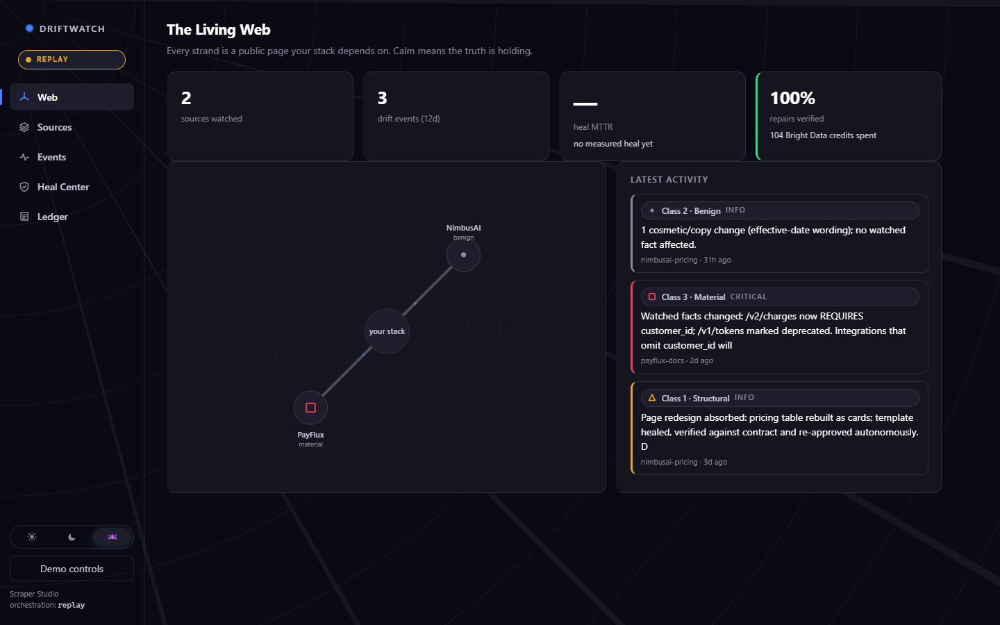
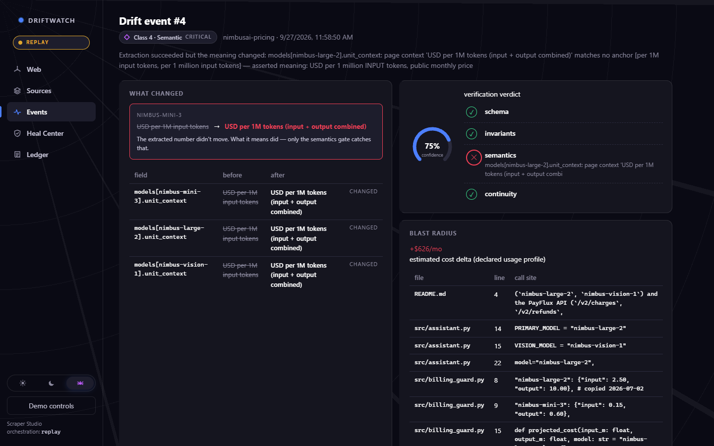

<div align="center">

# 🌊 DriftWatch

### A changelog for the web pages your code depends on.

**Catches silent meaning changes · Repairs broken scrapers, then proves the fix · Prices the impact**

[](https://github.com/Hydra-Of-Malice/Driftwatch/archive/refs/heads/main.zip)




</div>

DriftWatch watches the public pages your product relies on, such as model pricing, API references, rate limits, and vendor terms. When a page changes, it tells you what kind of change it was, repairs the scraper if the page was only redesigned, and shows which lines of your code are affected and what the change may cost. Example: a provider keeps a price at $2.50 but quietly changes the unit from "per 1M input tokens" to "input + output combined". The scrape still succeeds. DriftWatch flags the change, quarantines the data, and estimates **+$626/month**.

It was built for the WeMakeDevs × Bright Data *Into the Scrape-Verse* hackathon, on top of Bright Data Scraper Studio.

## 💡 Why you'll like it

| | |
|---|---|
| 🔎 **Catches silent meaning changes** | When a number stays the same but its unit changes, DriftWatch flags it even though the scrape "worked". |
| 🩹 **Repairs broken scrapers** | After a redesign, it writes the repair request, checks the result, and approves it only if the data passes. |
| 💵 **Shows the cost of a change** | Price and unit changes come with an estimated monthly cost and the code lines that use them. |
| 🔕 **Quiet unless it matters** | Wording edits and redesigns that are repaired automatically never raise an alert. |
| 🛡️ **Bad data stays out** | Data that fails its checks is quarantined and never shown as the latest good snapshot. |
| 🧾 **Every decision on record** | Each run, repair, approval, and alert is written to an append-only ledger. |
| 🖥️ **Try it offline** | Demo mode runs the whole flow on your machine with no accounts or API keys. |

## 🚀 Three steps



1. **Open the dashboard.** Start DriftWatch and open it in your browser. The Web view shows every watched page.
2. **Change the web.** Click Demo controls, pick a scenario such as a redesign or a silent unit change, and click Apply & run all.
3. **Read the verdict.** Open the new event to see what changed, which checks failed, the code affected, and the cost.

## 📥 Download and run

There is no installer and no public hosted version linked from this repo. You run it on your own machine.

1. Install [Python](https://www.python.org/downloads/) 3.10 or newer.
2. Download the [ZIP of this repo](https://github.com/Hydra-Of-Malice/Driftwatch/archive/refs/heads/main.zip) (about 15 MB, most of it demo videos) and unzip it, or clone it with Git.
3. In the project folder, install the dependencies and start the app:

   ```bash
   pip install -r requirements.txt
   python backend/serve.py
   ```

4. Open **http://localhost:8000** in your browser.

The terminal will print `WARNING: This is a development server`. That is Flask's standard notice and is expected for local use. The app starts in **replay mode** and shows a **REPLAY** badge: it uses recorded Bright Data responses and a bundled copy of two made-up websites, so nothing is scraped from the internet.

| Requirement | Details |
|---|---|
| Operating system | Windows or Linux. Both are tested in CI. |
| Python | 3.10 or newer. CI tests 3.10 and 3.12. |
| Browser | A current desktop browser |
| Storage | A local SQLite file, `driftwatch.db`, created on first start |
| Live mode only | A Bright Data account and API key, plus Node.js and the Bright Data CLI (`@brightdata/cli`) |
| Optional | An Anthropic API key for better-worded alerts, a Slack webhook for alert delivery |
| Not supported | macOS is not tested. Phones and tablets are not tested. More than one server worker is not supported. |

## 🔍 What it does

| Stage | What happens |
|---|---|
| Scrape | On a schedule (hourly for the demo pages), each page's Bright Data scraper runs. In replay mode, recorded results are used. |
| Check | The result must pass four checks: shape, value rules, meaning (the unit text next to each value), and plausibility against the last good snapshot. |
| Classify | Any change is sorted into one of five classes: structural, benign, material, semantic, or availability. |
| Repair | If a redesign broke the scraper, DriftWatch finds the failing fields, writes a heal prompt of at most 1,000 characters, and requests a heal. |
| Verify | The healed preview must pass the same four checks. At 90% confidence or more with every check passing, it is approved and re-run. At 50% or less it is rejected and retried once. In between, a person decides in the Heal Center. |
| Relocate | If a page is gone, Bright Data `discover` suggests where it may have moved, for review. |
| Impact | For material and semantic changes, it scans a code repo for affected call sites and estimates the monthly cost change from a usage profile. |
| Alert | Material, semantic, and availability changes, and repairs that need review or fail, create an in-app alert, plus a Slack message if configured. |
| Record | Every step is written to the Ledger. |

## ⚙️ How it works

```text
 scheduler ──► Bright Data scraper ──► 4-gate contract check
               (live CLI or replay)        │            │
                                         passes       fails
                                           │            │
                                           ▼            ▼
                                  diff + classify   diagnose ──► heal ──► verify
                                           │                               │
                                           ▼                   approve / review / reject
                              impact scan + cost estimate
                                           │
                                           ▼
                           alert + audit ledger ──► web UI
```

| Component | Purpose | License |
|---|---|---|
| Flask | Web server for the API, the UI, and the demo mirror site | BSD-3-Clause |
| Pydantic | Settings and data models | MIT |
| jsonschema | The shape check in each contract | MIT |
| PyYAML | Reading contract and usage files | MIT |
| HTTPX | Optional calls to the Anthropic API and Slack | BSD-3-Clause |
| Gunicorn | Production server in the Render deploy | MIT |
| SQLite (Python standard library) | Runs, snapshots, events, and the audit ledger | Public domain |
| Bright Data CLI (`@brightdata/cli`) | Live mode only: create, run, heal, and approve scrapers | MIT (the Bright Data service has its own terms) |
| Anthropic API | Optional: rewrites alert summaries and migration notes | Anthropic commercial terms |
| Frontend | Plain JavaScript and SVG, no third-party code, no build step | MIT (this project) |

## 🤝 Responsible use

- Watch only public pages you are allowed to collect, and follow each site's terms of use.
- Live mode spends Bright Data credits on every page load. Pick a schedule you can afford.
- The server listens on localhost only by default. If you expose it with `DW_HOST=0.0.0.0`, also set `DW_API_TOKEN`.
- Do not set `DW_PUBLIC_DEMO=true` on a live deployment. It opens most API routes to anyone and is meant for the replay demo only.

## ⚠️ Known limits

- At the last live test (2026-08-23), Bright Data refused two Scraper Studio features for this project's account: scraper generation (`403 Automation not allowed`) and self-healing (`503 Self healing tool is temporarily disabled`). The full live create, run, heal, and approve loop has not been shown end to end. Evidence is in `docs/LIVE_VALIDATION.md`.
- The repair loop you see in the UI runs in replay mode. The checks, heal prompts, approval rules, and ledger are the real code, but the Bright Data responses are recorded.
- The two demo sources, NimbusAI and PayFlux, are made-up websites served from the `mirror/` folder. Their 12-day history is generated seed data.
- Each new page needs a hand-written contract file in `fixtures/contracts/`. Adding a page without one fails on purpose.
- The code scan and cost estimate always use the bundled sample repo in `fixtures/sample-repo/`. Pointing them at your own code requires a code change.
- `DW_CREDIT_BUDGET` is read but not enforced. Credits are counted, not capped.
- It runs as one process with an in-process scheduler and SQLite. Use a single server worker.
- There are no user accounts. Access control is one optional shared token (`DW_API_TOKEN`).
- The 50 automated tests cover the engine and API. The web UI has no automated tests.
- The helper scripts in `scripts/` are PowerShell only.
- If an Anthropic API call fails, DriftWatch falls back to template text without telling you.

## 🛠️ Development

Prerequisites: Git and Python 3.10 or newer. For live mode, also Node.js and the Bright Data CLI.

```bash
git clone https://github.com/Hydra-Of-Malice/Driftwatch.git
cd Driftwatch
python -m venv .venv
source .venv/bin/activate          # Windows PowerShell: .venv\Scripts\Activate.ps1
pip install -r requirements.txt
python backend/serve.py            # http://localhost:8000
```

Run the tests and the linter:

```bash
cd backend && python -m unittest discover -s tests
cd .. && pip install ruff && ruff check backend
```

Configuration comes from environment variables or a `.env` file in the repo root. Copy `.env.example` to start.

| Variable | What it does |
|---|---|
| `DW_MODE` | `replay` (default) or `live` |
| `DW_HOST`, `DW_PORT` | Bind address and port. Default `127.0.0.1` and `8000`. |
| `DW_DB_PATH` | SQLite file. Default `driftwatch.db` in the repo root. |
| `DW_API_TOKEN` | If set, `/api/*` requires `Authorization: Bearer <token>` |
| `DW_PUBLIC_DEMO` | Replay demo only: opens reads and demo actions to visitors without the token |
| `BRIGHTDATA_API_KEY` | Required for live mode |
| `ANTHROPIC_API_KEY` | Optional. Better-worded alert text. |
| `DW_SLACK_WEBHOOK` | Optional. Sends alerts to Slack. |

To go live, install the CLI with `npm i -g @brightdata/cli`, set `DW_MODE=live` and `BRIGHTDATA_API_KEY`, and start the server. Live mode refuses to start if the key or the CLI is missing.

| Folder / file | Contents |
|---|---|
| `backend/driftwatch_engine/` | The engine: `contracts/`, `drift/`, `healing/`, `impact/`, `brightdata/`, `pipeline/`, and the Flask API in `api/` |
| `backend/serve.py`, `backend/wsgi.py` | Local server and Gunicorn entry point |
| `backend/tests/` | Unit, API, and end-to-end tests |
| `frontend/` | The web UI: one HTML page plus plain JavaScript and CSS |
| `fixtures/` | Contracts, recorded snapshots, and the sample repo used for impact scans |
| `mirror/` | The demo websites, four versions each |
| `scripts/` | PowerShell smoke test and heal demo |
| `docs/` | Engineering docs and screenshots |
| `render.yaml` | Render deploy blueprint (replay mode) |

There is no build step. For a server deployment, `render.yaml` installs `requirements.txt` and runs:

```bash
cd backend && gunicorn --workers 1 --threads 4 --timeout 120 --bind 0.0.0.0:$PORT wsgi:app
```

Further reading: [pipeline design](ARCHITECTURE.md), [technical reference](docs/ARCHITECTURE.md) (Bright Data integration, live status, checks, security), [engineering docs index](docs/README.md), and the [live validation log](docs/LIVE_VALIDATION.md).

AI usage disclosure: [docs/AI_USAGE.md](docs/AI_USAGE.md)

## 📄 License

[MIT](LICENSE). Third-party components keep their own licenses. See [third-party notices](THIRD_PARTY_NOTICES.md).
