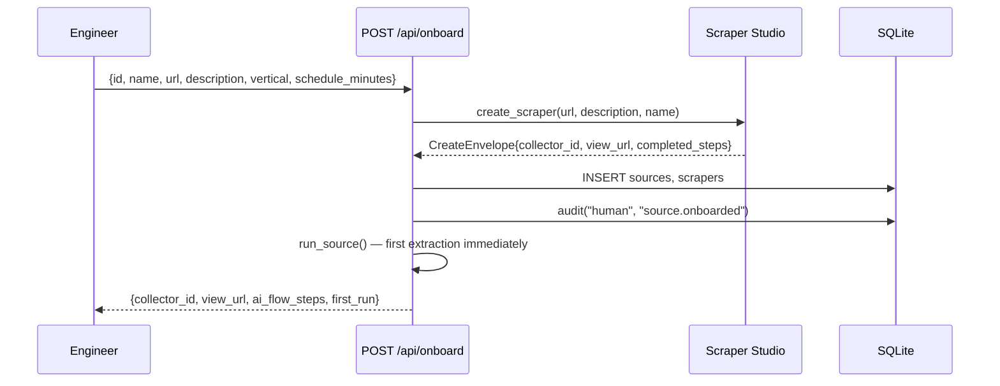
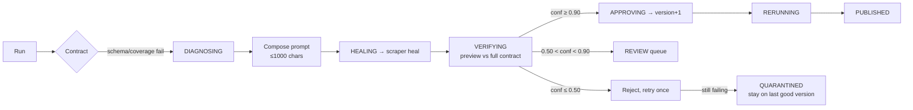

# User Journey

[← Documentation index](../README.md)

---

Each stage below maps to code that exists. Stages that are **NOT IMPLEMENTED** are marked; they are included because omitting them would misrepresent the product surface.

## 1. Discovery

A team realises a number in their product came from a page nobody is watching.

**System involvement:** none. No landing page, no signup, no marketing surface. **NOT IMPLEMENTED** — the project is a reference build, not a hosted product.

## 2. Onboarding a source

The engineer describes the fields they want in plain language. Scraper Studio's AI Flow generates the scraper and returns a `collector_id`.
Evidence: `api/app.py :: onboard`

**Then a manual step, and it is a real friction point.** The semantic contract is **not** generated from the description — the engineer must hand-author `fixtures/contracts/<source_id>.yaml` with schema, invariants, semantic assertions, and continuity rules. `load_spec()` reads that file from disk and raises if it is absent.

> **PARTIALLY IMPLEMENTED.** Onboarding creates the scraper but not its contract. A source onboarded via the API will fail its first run with a missing-contract error unless the YAML is written first.
> Evidence: `contracts/engine.py :: load_spec` — no fallback, no auto-draft path.
> The `contracts.created_from` column anticipates an `"auto_draft"` value that nothing currently writes.

## 3. Steady state

The scheduler thread wakes every 30 s and runs any active source whose last run is older than its `schedule_minutes`.

For an unchanged page:
1. `run_scraper` returns the payload
2. Content hash matches last-known-good **and** the verdict passes → published immediately, `class: 0`, no diff computed
3. One row in `runs`, one in `snapshots`, audit entries for the transitions

The engineer sees nothing. That is the intended experience.
Evidence: `scheduler.py :: _due_sources`, `pipeline/runner.py :: run_source` fast path

## 4. A page is redesigned (Class 1 — invisible to the user)

If the heal verifies, the user's only artefact is a Class 1 event in the ledger. No alert fires — Class 1 that resolves is informational.

**Verified behaviour:** driving `v2_redesign` through the live API returns `class: 1, state: published, healed: true`.

## 5. The meaning changes (Class 4 — the alert that matters)

The page is structurally identical; the unit text changed.

1. Schema ✅, invariants ✅, **semantics ❌**
2. Snapshot written with `quarantined = 1` — never becomes the new baseline
3. Diff computed against last-known-good; cost estimated via `_unit_flip_delta`
4. Alert dispatched at `critical`
5. Run ends in `REVIEW`

The engineer receives one alert carrying the class, the failing anchor, the dollar delta, the affected call sites, and a migration note.

**Verified behaviour:** `v3_semantic` returns `class: 4, state: review`.
Evidence: `pipeline/runner.py :: _handle_semantic`

## 6. A watched fact changes (Class 3)

Schema, invariants, semantics all pass — but a significant field moved. Data **is** published (it is correct, it just changed), an event is recorded, impact and cost computed, alert dispatched.

**Verified behaviour:** `v4_material` returns `class: 3, state: published, cost_delta_monthly: 412.0`.

The distinction from Class 4 is the point: Class 3 is *the world changed and we can trust the number*; Class 4 is *the world changed and we cannot*.

## 7. The page disappears (Class 5)

Fetch fails → `RELOCATING` → `discover()` proposes candidate URLs → critical alert → `REVIEW`.

Relocation candidates are surfaced for approval but **there is no endpoint to accept one.** `POST /api/review/<heal_id>` operates on `heal_events`, and a Class 5 event creates no heal row.

> **PARTIALLY IMPLEMENTED.** Detection, discovery, and alerting work; applying a relocation requires editing the `sources` row directly.
> Evidence: `pipeline/runner.py :: _handle_unreachable`; no writer for `sources.url` exists outside `onboard`.

## 8. Human review

For gray-band heals, the engineer opens the Heal Center, sees the machine-composed prompt, the preview payload, and the gate-by-gate verdict, then approves or rejects. The same `client.approve()` call the machine would have made is issued, and on approval the source is immediately re-run.
Evidence: `api/app.py :: review_decide`, `healing/orchestrator.py :: decide_review`

## 9. Audit

Every run transition, heal request, verification result, approval, rejection, and alert is an append-only row in `audit_events` with actor `machine`, `human`, or `scheduler`.
Evidence: `db.py :: audit`

## Journey friction — honest summary

| Stage | Friction | Severity |
|---|---|---|
| Onboarding | Contract YAML must be hand-written; no auto-draft | **High** — blocks self-service |
| Class 5 resolution | No endpoint to apply a relocation | **Medium** |
| All stages | Authentication is opt-in (`DW_API_TOKEN`, added 2026-08-22), off by default; anyone reaching the port can approve heals or trigger runs unless it's set | **High** — see [Threat Model](../06_Security/Threat_Model.md) |
| Steady state | Scheduler is in-process; restarting loses nothing but stops all scheduling | **Low** for demo, **High** for production |

---

**Next:** [Use Cases](Use_Cases.md) · [Sequence Diagrams](../03_Architecture/Sequence_Diagrams.md)
