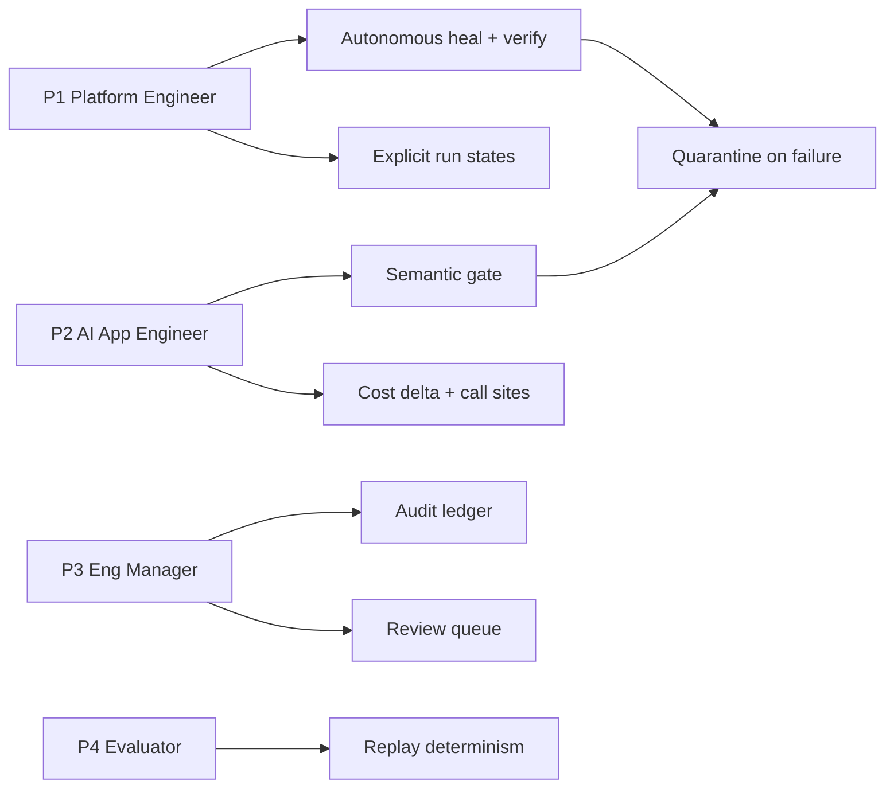

# User Personas

[← Documentation index](../README.md)

---

These personas are derived from the capabilities the system actually implements — each need below maps to a shipped feature and a use case. They are not market research, and no claim is made that these personas were validated through user interviews. **No user research has been conducted.**

---

## P1 — Platform Engineer ("owns the pipeline")

| | |
|---|---|
| **Role** | Data/platform engineer maintaining scheduled extraction jobs |
| **Technical proficiency** | High — Python, SQL, CI, containers |
| **Primary goal** | Stop being the person who discovers breakage from a downstream complaint |
| **Secondary goal** | Reduce time spent rewriting selectors |

**Pain points**
- Finds out about failures days late, from bad data rather than an alert
- Every page redesign is unplanned maintenance work
- Cannot tell "no data" from "wrong data" on a dashboard

**System needs → implementation**

| Need | Served by | Status |
|---|---|---|
| Autonomous repair of structural breaks | `healing/orchestrator.py` | **VALIDATED (replay)** |
| Assurance the repair is correct | `healing/verifier.py` | **VALIDATED** |
| Visible pipeline state, not just success/fail | `domain.py :: RunState` (17 states) | **IMPLEMENTED** |
| Rollback when a repair is wrong | Version pinning — active version only advances after verified re-run | **IMPLEMENTED** |

**Journey:** [User Journey § Steady state](User_Journey.md#3-steady-state) · **Use cases:** UC-004, UC-005, UC-006

---

## P2 — AI Application Engineer ("pays the model bill")

| | |
|---|---|
| **Role** | Builds product features on paid model APIs |
| **Technical proficiency** | High — application code, less so data infrastructure |
| **Primary goal** | Never be surprised by an invoice |
| **Secondary goal** | Know which code to change when a provider changes something |

**Pain points**
- Provider pricing and billing units change without notification
- A unit redefinition costs real money and produces no signal anywhere
- After a change, no fast way to find affected call sites

**System needs → implementation**

| Need | Served by | Status |
|---|---|---|
| Catch unit/scope redefinition | `contracts/engine.py :: _gate_semantics` | **VALIDATED** |
| Dollar figure attached to the change | `impact/cost.py :: _unit_flip_delta`, `_material_delta` | **VALIDATED** |
| Affected call sites in own codebase | `impact/scanner.py :: scan_repo` | **VALIDATED** |
| Actionable migration note | `llm/provider.py :: migration_note` | **IMPLEMENTED** |

This is the persona the semantic gate exists for. The `$2.50` unit-flip scenario is theirs.

**Use cases:** UC-002, UC-008, UC-009

---

## P3 — Engineering Manager / Tech Lead ("answers for the numbers")

| | |
|---|---|
| **Role** | Owns delivery and correctness of a data-dependent product |
| **Technical proficiency** | Medium-high — reads dashboards and code, does not maintain scrapers |
| **Primary goal** | Trust the dashboard, and be able to prove why a number changed |
| **Secondary goal** | Bound how much autonomy the automation has |

**Pain points**
- No provenance for a number that moved
- Cannot distinguish "the world changed" from "our pipeline broke"
- Uncomfortable with automation approving its own changes unsupervised

**System needs → implementation**

| Need | Served by | Status |
|---|---|---|
| Append-only decision record | `audit_events` table; `db.audit()` | **IMPLEMENTED** |
| Human veto on uncertain repairs | Gray band → `status='review'`; `POST /api/review/<id>` | **VALIDATED** |
| Change classified by cause, not symptom | `domain.py :: DriftClass` | **VALIDATED** |
| No alert fatigue | Classes 0–2 never alert | **VALIDATED** |

The three-band policy exists specifically for this persona: automation acts when confident, escalates when not, and records both.

**Use cases:** UC-007, UC-010, UC-011

---

## P4 — Hackathon / Technical Evaluator ("has 10 minutes")

| | |
|---|---|
| **Role** | Judge or reviewer assessing the system cold |
| **Technical proficiency** | High |
| **Primary goal** | Determine quickly whether this is engineered or demoed |

**Pain points**
- Projects that only run on the author's machine
- Claims with no evidence behind them
- Demos that show UI rather than mechanism

**System needs → implementation**

| Need | Served by | Status |
|---|---|---|
| Runs offline, deterministically, first try | `ReplayClient` + mirror site; no external calls | **VALIDATED** |
| Break-and-heal reproducible on demand | `POST /api/demo/state` variant control | **VALIDATED** |
| Claims traceable to tests | This documentation set + 23 tests | **IMPLEMENTED** |
| Honest about limitations | Status labels throughout | **IMPLEMENTED** |

**Runbook:** [Demo Runbook](../11_Assessment/Demo_Runbook.md)

---

## Persona → capability coverage

## Personas explicitly not served

| Persona | Why not |
|---|---|
| Non-technical business analyst | No no-code onboarding; sources are configured by YAML contract files |
| Security/compliance officer | Authentication is opt-in and off by default, no RBAC, no data-retention controls — see [Security Architecture](../06_Security/Security_Architecture.md) |
| Multi-tenant SaaS operator | No tenancy model; single shared SQLite database |

---

**Next:** [User Journey](User_Journey.md) · [Use Cases](Use_Cases.md)
