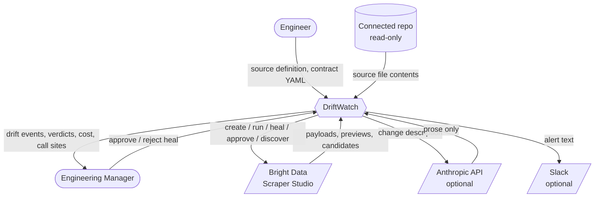
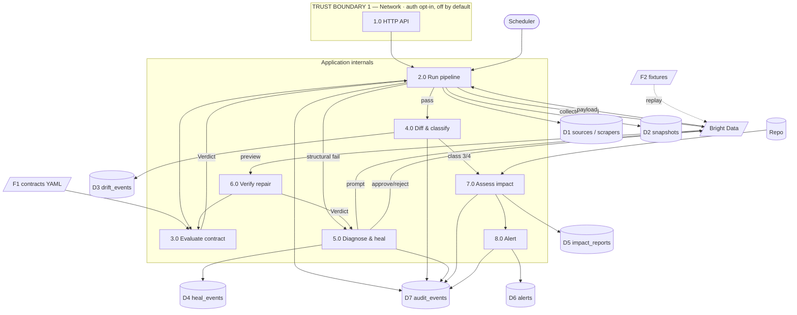
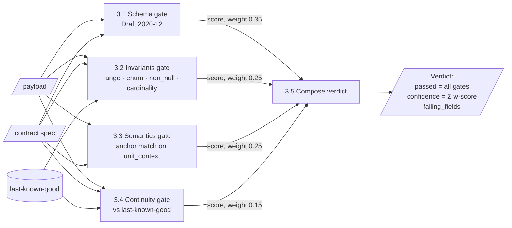
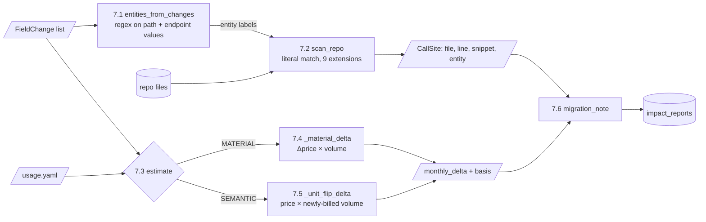
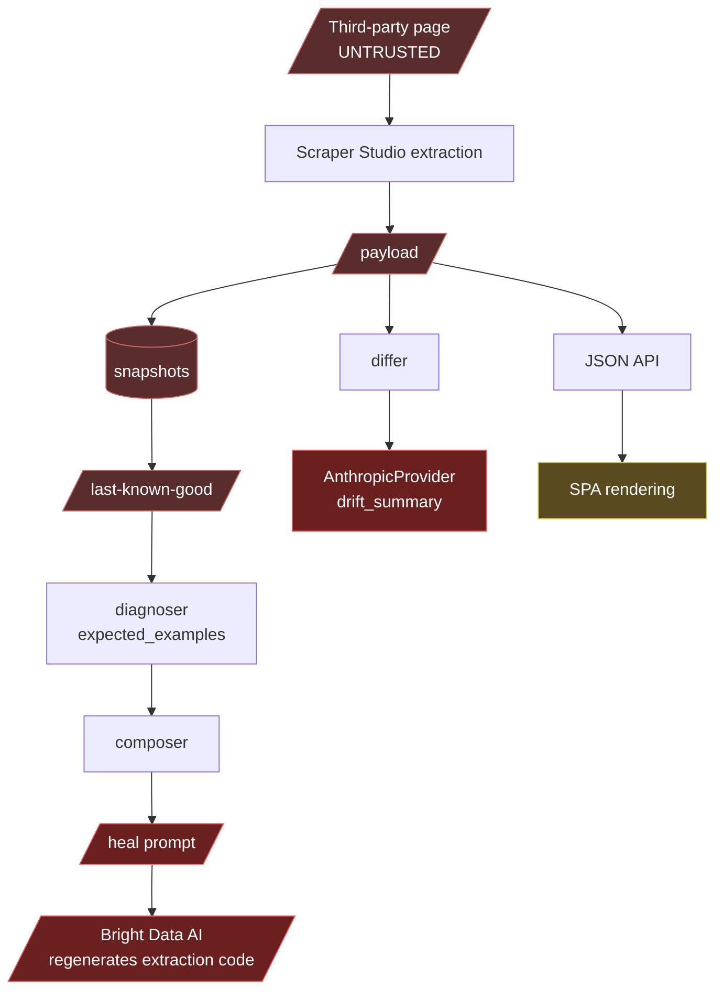

# Data Flow Diagrams

[← Documentation index](../README.md) · [← HLD](HLD.md)

---

## DFD Level 0 — Context

**Trust note.** Only two inbound flows are trusted: the engineer's contract YAML and the manager's decision. Everything from Bright Data originates on a third-party web page and is **untrusted input**.

---

## DFD Level 1 — Major flows

### Store write matrix

| Store | Written by | Read by |
|---|---|---|
| D1 sources/scrapers | 1.0 onboard, 5.0 version bump | 2.0, API |
| D2 snapshots | 2.0 | 2.0 (last-known-good), API |
| D3 drift_events | 2.0/4.0 | API |
| D4 heal_events | 5.0 | 5.0, API |
| D5 impact_reports | 7.0 | API |
| D6 alerts | 8.0 | API |
| D7 audit_events | **all** | API (append-only) |

---

## DFD Level 2 — Contract evaluation (process 3.0)

The four gates are **independent** — none reads another's result. That independence is what allows the classifier to distinguish "shape broke" from "meaning broke" by inspecting which gate failed.

---

## DFD Level 2 — Impact assessment (process 7.0)

7.5 is the interesting path: it produces a dollar figure for a change where **no numeric value moved at all**, by applying the unchanged price to volume that was previously not billed.
Evidence: `impact/cost.py :: _unit_flip_delta`

---

## Untrusted data flow — the security-relevant view

This traces third-party page content through the system. It is the basis for [Threat Model T-08](../06_Security/Threat_Model.md).

Three sinks receive untrusted content with **no sanitisation**:

| Sink | Path | Consequence |
|---|---|---|
| Heal prompt → vendor AI | `snapshots.payload` → `diagnoser.expected_examples` → `composer` → `heal_scraper()` | Page content becomes instructions to an AI that generates executable extraction logic |
| Anthropic prompt | `FieldChange.before/after` → `drift_summary()` | Standard prompt injection into alert prose |
| SPA | `payload` → `/api/events/<id>` → DOM | XSS if any render path misses `esc()` |

The first is the most serious and is genuinely novel as a risk class: **indirect prompt injection where the injected content influences generated scraping code.** No mitigation exists (SEC-007, AI-006 both **NOT IMPLEMENTED**).

---

**Next:** [ADRs](ADRs/README.md) · [Threat Model](../06_Security/Threat_Model.md)
