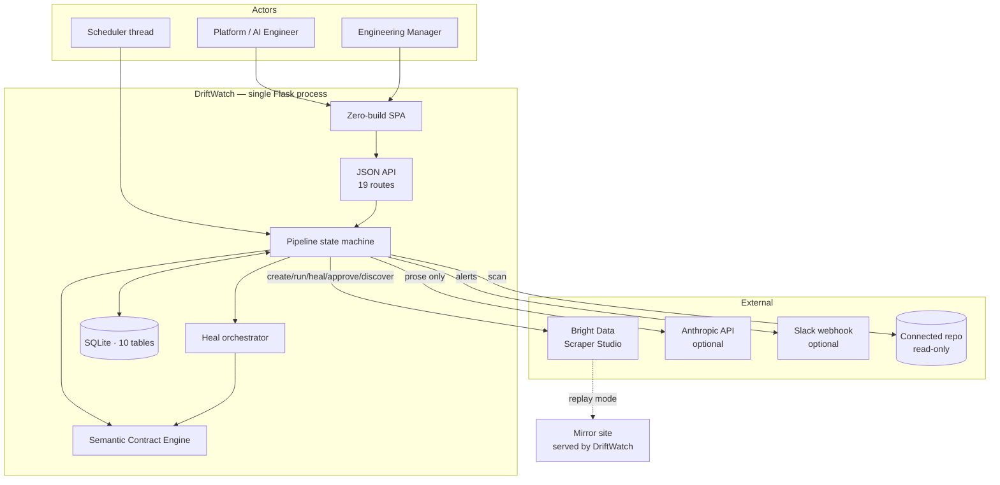
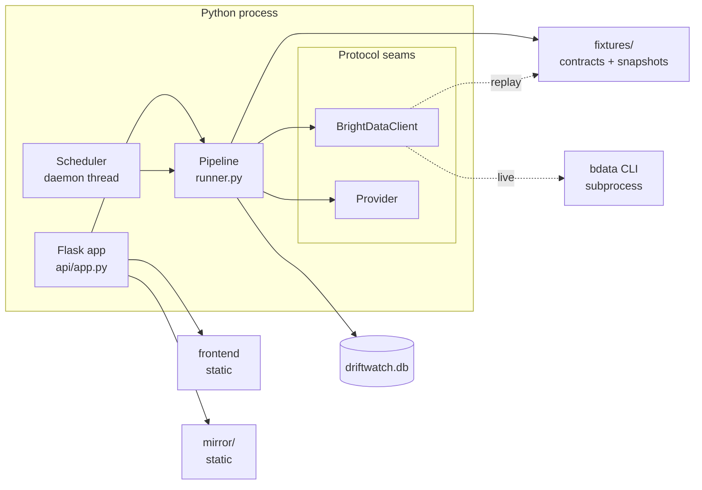
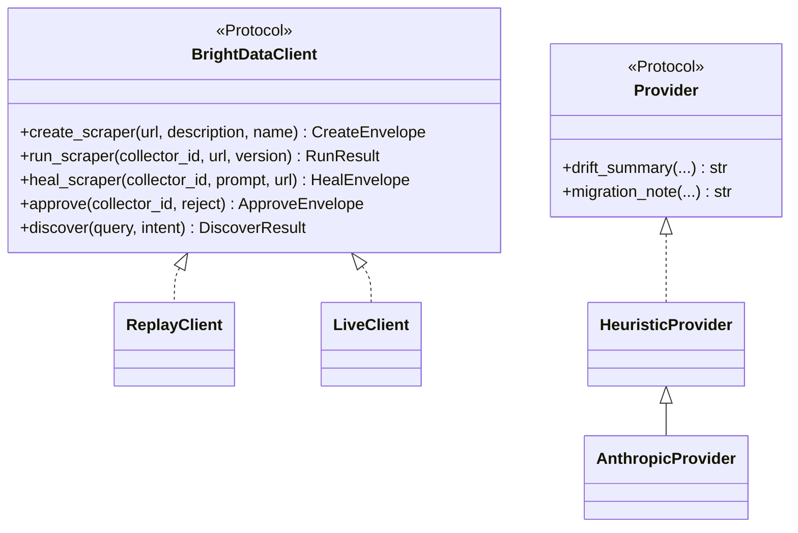
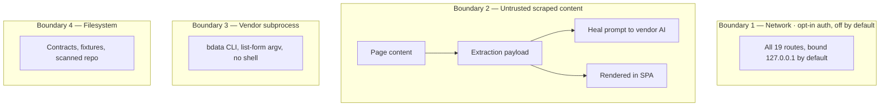
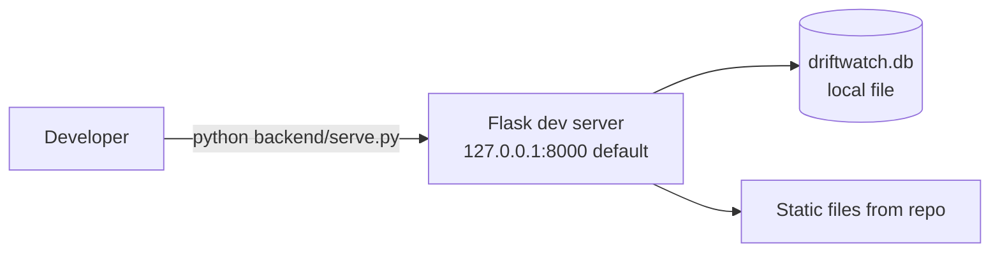

# High-Level Design

[← Documentation index](../README.md)

---

## 1. Architectural style

**Modular monolith, single process, synchronous pipeline, with dependency inversion at every external boundary.**

This is a deliberate choice for a 7-day build, and it is defensible on its merits rather than only on time pressure — see [ADR-001](ADRs/README.md#adr-001--modular-monolith-over-services). The system has one workload (run a source through a pipeline), one writer, and no independent scaling axis. Services would have added deployment surface without removing coupling.

| Property | Value |
|---|---|
| Processes | 1 (Flask) + 1 daemon thread (scheduler) |
| Datastore | SQLite, WAL mode, per-thread connections |
| External calls | Bright Data (optional), Anthropic (optional), Slack (optional) |
| Runtime dependencies | 5 |
| Build step | None — SPA is vanilla ES modules |

## 2. System context



**Note on the mirror.** In replay mode Bright Data calls are served by `ReplayClient` from fixtures; the mirror site exists so a human can *see* the page change. The replay client reads fixtures, not the mirror HTML — they are kept consistent by construction.
Evidence: `brightdata/replay.py :: _truth`

## 3. Container view



## 4. Component responsibilities

| Component | File | Responsibility |
|---|---|---|
| HTTP surface | `api/app.py` | 19 routes; SPA, assets, mirror, JSON API. No business logic |
| Pipeline | `pipeline/runner.py` | State machine; the only place run state is written |
| Contract engine | `contracts/engine.py` | Four gates + weighted confidence. **Pure function** |
| Path resolver | `contracts/paths.py` | `a[].b` → concrete entity-labelled paths |
| Differ | `drift/differ.py` | Entity-resolved field diff. **Pure** |
| Classifier | `drift/classifier.py` | Verdict + changes → drift class. **Pure** |
| Diagnoser | `healing/diagnoser.py` | Verdict → failing fields + last-good examples. **Pure** |
| Composer | `healing/composer.py` | Diagnosis → ≤1000-char prompt. **Pure, deterministic** |
| Verifier | `healing/verifier.py` | Preview → Verdict via the same `evaluate()` |
| Orchestrator | `healing/orchestrator.py` | Heal lifecycle + three-band policy. Writes state |
| Impact scanner | `impact/scanner.py` | Literal entity scan over a repo |
| Cost estimator | `impact/cost.py` | Material and unit-flip dollar deltas. **Pure** |
| Alerts | `alerts.py` | Zero-noise dispatch |
| Scheduler | `scheduler.py` | Due-source detection loop |
| Persistence | `db.py` | Schema, per-thread connections, audit writer |
| Domain | `domain.py` | Taxonomy, states, contract and verdict types |

**Nine of fifteen components are pure functions.** That is why the test suite can be fast and deterministic, and why 23 tests cover the decision logic meaningfully.

## 5. The two seams



Two properties worth noting:

1. **`AnthropicProvider` extends `HeuristicProvider`.** Fallback is inheritance, not a conditional — any failure returns `None` and delegates to `super()`. Degradation is structural.
2. **The `Provider` interface returns only `str`.** It is impossible for the model to influence a decision, because no method returns anything a branch could read.

Evidence: `llm/provider.py`, `brightdata/protocol.py`

## 6. Pipeline state machine

```mermaid
stateDiagram-v2
  [*] --> SCRAPING
  SCRAPING --> RELOCATING: fetch failed
  RELOCATING --> REVIEW: Class 5
  SCRAPING --> VALIDATING
  VALIDATING --> PUBLISHED: hash match + pass (Class 0)
  VALIDATING --> DIAGNOSING: structural
  VALIDATING --> IMPACT: semantics failed
  VALIDATING --> DIFFING: verdict passes

  DIAGNOSING --> HEALING
  HEALING --> VERIFYING
  VERIFYING --> APPROVING: conf >= 0.90
  VERIFYING --> REVIEW: gray band
  VERIFYING --> QUARANTINED: conf <= 0.50 twice
  APPROVING --> RERUNNING --> DIFFING

  IMPACT --> ALERTING --> REVIEW: Class 4
  DIFFING --> CLASSIFYING
  CLASSIFYING --> PUBLISHED: Class 0/1/2
  CLASSIFYING --> IMPACT: Class 3
  PUBLISHED --> [*]
  REVIEW --> [*]
  QUARANTINED --> [*]
```

Every transition calls `_set_state()`, which writes the run row **and** an audit event. There is no code path that changes run state without auditing it.
Evidence: `pipeline/runner.py :: _set_state`

## 7. Trust boundaries



| Boundary | Control | Status |
|---|---|---|
| 1 Network | Bearer-token gate, `127.0.0.1` default bind | **PARTIALLY IMPLEMENTED** (2026-08-22) — opt-in via `DW_API_TOKEN`; off by default. See [GAP-01](../02_Requirements/Requirements_Gap_Analysis.md#gap-01--no-authentication-on-any-endpoint) |
| 2 Scraped content → prompt | None | **NOT IMPLEMENTED** — SEC-007, threat T-08 |
| 2 Scraped content → UI | `esc()` helper in `app.js` | **PARTIAL** — not systematically verified |
| 3 Subprocess | List-form argv, fixed binary, no `shell=True` | **IMPLEMENTED** |
| 4 Filesystem | Path is derived from `source_id`; no traversal guard | **PARTIAL** |

Boundary 2 is the most interesting and least defended: **scraped page content flows into a prompt sent to a vendor AI that regenerates executable extraction logic.** Analysed in [Threat Model T-08](../06_Security/Threat_Model.md).

## 8. Data stores

| Store | Technology | Contents |
|---|---|---|
| Operational DB | SQLite (WAL) | 10 tables — [Database Design](../04_Data/Database_Design.md) |
| Contracts | YAML on disk | One per source; hand-authored |
| Fixtures | JSON on disk | Ground-truth and broken payloads per variant |
| Mirror | Static HTML | Four variants per source |

**The contract lives on disk, not in the database** — while the `contracts` table exists and is populated by `seed.py`. `load_spec()` reads the YAML file; nothing reads the table. This is a genuine inconsistency: the table is written but never used as a source of truth.
Evidence: `contracts/engine.py :: load_spec` reads `FIXTURES_DIR`; no `SELECT` against `contracts` outside `api/app.py :: source_detail` (display only)

## 9. Communication

| Path | Protocol | Sync? |
|---|---|---|
| SPA → API | HTTP/JSON, `fetch` | Sync |
| Scheduler → pipeline | In-process call | Sync |
| Pipeline → Bright Data (live) | `subprocess` → CLI → HTTPS | Sync, blocking, 900 s timeout |
| Pipeline → Anthropic | HTTPS via `httpx`, 30 s | Sync |
| Pipeline → Slack | HTTPS via `httpx`, 10 s | Sync |

**Everything is synchronous.** `POST /api/run-all` runs sources sequentially in the request thread; a live-mode run blocks a Flask worker for up to 900 seconds. There is no queue and no async execution.
Consequence and mitigation: [Reliability](../10_Operations/Reliability_and_Failure_Design.md).

## 10. Deployment topology



That is the whole topology. **No container, no reverse proxy, no WSGI server, no TLS, no process supervisor.** `app.run()` is Flask's development server, explicitly not for production use.
Detail: [Deployment Architecture](../08_Deployment/Deployment_Architecture.md).

## 11. Quality attributes — honest scoring

| Attribute | Assessment |
|---|---|
| **Correctness** | Strong. Pure functions, 23 tests, four independent validation gates |
| **Testability** | Strong. Protocol seams + pure logic make the suite meaningful |
| **Modularity** | Strong. Clear boundaries, no circular imports, business logic out of the HTTP layer |
| **Observability** | Moderate. Rich audit ledger; no metrics, logs, traces, or health endpoint |
| **Reliability** | Moderate. Good isolation of alert/scheduler failures; no retries, no budget guard |
| **Security** | Weak. No authentication anywhere |
| **Scalability** | Weak, by design. One process, one writer, sequential execution |
| **Operability** | Weak. No packaging, no migrations, no supervision |

The shape is consistent: **an architecture optimised for provable correctness of data, not for operation as a multi-tenant service.** For the problem it targets, that is the right order of priorities — the gaps are additive rather than structural.

---

**Next:** [LLD](LLD.md) · [Sequence Diagrams](Sequence_Diagrams.md) · [ADRs](ADRs/README.md)
