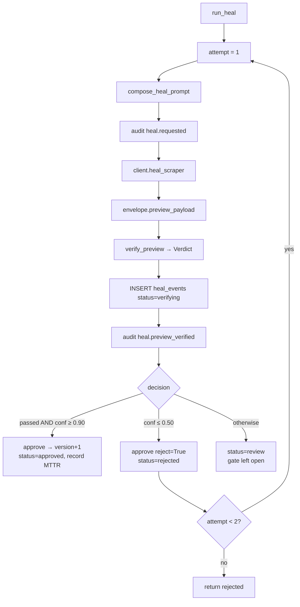

# Low-Level Design

[← Documentation index](../README.md) · [← HLD](HLD.md)

---

Covers the four architecturally significant modules. Trivial helpers are omitted deliberately.

---

## 1. Semantic Contract Engine

**File:** `backend/driftwatch_engine/contracts/engine.py` (179 lines)
**Responsibility:** Decide whether an extraction payload is trustworthy, and by how much.
**Purity:** Pure — no I/O except `load_spec()`.

### 1.1 Interface

```python
def evaluate(payload: dict, spec: ContractSpec, last_good: dict | None = None) -> Verdict
```

Used in exactly two places, and that is the design's central economy:

| Caller | Purpose |
|---|---|
| `pipeline/runner.py` | Validate a fresh extraction |
| `healing/verifier.py` | Validate a heal preview |

**One definition of correctness governs both fresh data and repairs.** A repair cannot be accepted under a weaker standard than the one that rejected the original.

### 1.2 Gate algorithms

| Gate | Weight | Mechanism | Partial credit |
|---|---|---|---|
| `schema` | 0.35 | `Draft202012Validator`, first 25 errors | **No** — binary 0.0 or 1.0 |
| `invariants` | 0.25 | `range` / `enum` / `non_null` / `cardinality_drop` | Yes — `(checks − failures) / checks` |
| `semantics` | 0.25 | Case-insensitive substring anchor match on unit-context | Yes |
| `continuity` | 0.15 | `max_change_pct`, `max_cardinality_drop_pct` vs last-good | Yes |

```python
confidence = Σ GATE_WEIGHTS[gate] × score(gate)
passed     = all(gate.passed)
```

Note the asymmetry: `passed` is a strict conjunction, while `confidence` is a weighted blend. A payload can score 0.85 while failing — confidence drives *policy*, `passed` drives *correctness*.

### 1.3 The semantics gate — the system's distinguishing mechanism

```python
for assertion in spec.assertions:
    for concrete, context in resolve(payload, assertion.unit_context_field, spec.entity_key):
        text = str(context or "").lower()
        if not any(anchor.lower() in text for anchor in assertion.anchors):
            # FAIL — meaning drifted
```

The contract requires the extractor to capture `unit_context` verbatim from the page. The gate asserts at least one anchor phrase survives in it.

```yaml
assertions:
  - field: "models[].price_input_per_1m"
    meaning: "USD per 1 million INPUT tokens, public monthly price"
    unit_context_field: "models[].unit_context"
    anchors: ["per 1M input tokens", "per 1 million input tokens"]
```

**Design critique.** Substring matching is the weakest link. `"per 1M input tokens"` fails against `"per million input tokens"` unless the anchor list is maintained, producing false positives (Class 4 alert on a rephrase). Conversely a page saying `"per 1M input tokens (and output)"` **passes** — the anchor is present — while the meaning changed. The mechanism is sound; the matcher is naive.
**RECOMMENDED:** negative anchors (`must_not_contain`) would close the second hole cheaply.

### 1.4 Coverage as a structural tripwire

```python
def required_leaf_coverage(payload, spec) -> float:
    # fraction of schema-required leaf fields inside the main list that are non-null
```

Catches the case where extraction "succeeds" and returns structurally valid rows with null values — a partial break that schema validation alone permits if fields are nullable. Threshold `0.70` in `classifier.py`.

### 1.5 Complexity

| Operation | Complexity | Measured |
|---|---|---|
| `evaluate()` | O(items × rules) | p50 0.16 ms, p95 0.20 ms |
| `resolve()` | O(depth × items) | — |

---

## 2. Heal Orchestrator

**File:** `healing/orchestrator.py` (146 lines)
**Responsibility:** Convert a detected structural break into a verified template upgrade, or refuse.

### 2.1 Control flow



### 2.2 The three-band policy

| Band | Condition | Action |
|---|---|---|
| Auto-approve | `verdict.passed` **and** `confidence ≥ 0.90` | Approve, `active_version += 1`, record MTTR |
| Auto-reject | `confidence ≤ 0.50` | Reject, refine prompt with the failure reason, retry once |
| Review | otherwise | `status='review'`, leave the vendor's gate open for a human |

**Both conditions matter in the top band.** `verdict.passed and confidence >= threshold` — a payload could reach 0.91 confidence while failing one gate on partial credit. Requiring both means a failing gate can never auto-approve, regardless of score.

### 2.3 Retry refinement

On rejection, `prior_failure` is set from the failing gate details and injected into the next prompt:

> *"Previous fix attempt failed verification: {prior_failure}. Address this specifically."*

The second attempt is strictly more informed than the first. **Bounded at two attempts** — no unbounded loop, no exponential retry against a paid API.

### 2.4 Rollback

There is no rollback *operation*, because there is nothing to roll back: `scrapers.active_version` is incremented **only** on the auto-approve path, and the re-run uses `version=outcome.new_version`. A failed heal leaves the previous version active. Rollback is the absence of a mutation.
Evidence: `orchestrator.py`; `runner.py :: _handle_structural`

### 2.5 Convergence of machine and human paths

`decide_review()` (human) and `run_heal()` (machine) both terminate in `client.approve()`. The human path is not a parallel implementation — it is the same vendor call with different provenance recorded (`decided_by`).

### 2.6 Loop-exit analysis

`heal_event_id`, `verdict`, and `prompt` are referenced in the final `return` **outside** the `for` loop, which reads at a glance like a possibly-unbound bug. It is not:

- The only route to that statement is `continue` on attempt 2, by which point all three are bound from that iteration.
- If `client.heal_scraper()` raises, the exception propagates out of `run_heal()` and the statement is never reached.

**Verified safe.** Worth noting only because static analysis and human reviewers both flag this shape, and the reasoning above is not local to the return statement. **RECOMMENDED (cosmetic):** initialise before the loop to make the invariant obvious.

---

## 3. Drift Classifier

**File:** `drift/classifier.py` (106 lines) · **Purity:** Pure

### 3.1 Precedence

Ordered by **what remains knowable**, not by severity:

```
1. fetch_failed              → AVAILABILITY  (nothing is knowable)
2. schema ∨ invariants fail
   ∨ coverage < 0.70         → STRUCTURAL    (extraction untrustworthy)
3. semantics fail            → SEMANTIC      (value parsed, meaning void)
4. significant field changed → MATERIAL      (trustworthy, and it moved)
5. any change                → BENIGN
6. none                      → NONE
```

Each rung presupposes the ones above resolved cleanly — you cannot assess meaning if you cannot trust extraction.

### 3.2 Materiality

```python
material = [c for c in changes if is_significant(c.path, spec) or c.kind in ("added","removed")]
material = [c for c in material if _is_watched(c, spec)]
```

`is_significant` normalises `models[nimbus-large-2].price` → `models[].price` and matches against `significant_fields`. Whole-entity add/remove within the watched list is always material.

Severity escalates to `critical` when a numeric change exceeds ±10%, or a boolean/`deprecated` value appears.

### 3.3 Critique

`_is_critical` ends with:

```python
return isinstance(change.after, bool) or str(change.after).lower() in ("true", "deprecated")
```

String-matching `"deprecated"` is a domain heuristic embedded in generic classification logic. It works for the two seeded sources; it is not general. **RECOMMENDED:** move it to the contract as a `critical_values` list.

---

## 4. Entity-Resolved Differ

**File:** `drift/differ.py` (48 lines) · **Purity:** Pure

### 4.1 Algorithm

Recursive walk with a special case for lists of objects:

```python
before_map = {entity_label(item, i, entity_key): item for i, item in enumerate(before)}
after_map  = {entity_label(item, i, entity_key): item for i, item in enumerate(after)}
for label in before_map.keys() | after_map.keys():
    ...
```

`entity_label()` tries the contract's `entity_key`, then `("model_id","id","path","name")`, then falls back to the index.

**Why this matters:** index-based diffing would report every row as changed when a redesign reorders a table, making structural drift indistinguishable from total data replacement. Entity keying keeps the ledger longitudinal.
Evidence: `test_drift.py::test_reordering_entities_is_not_a_change`

### 4.2 Failure mode

If an entity's key value itself changes (`nimbus-large-2` → `nimbus-large-v2`), the differ reports one `removed` and one `added` rather than a rename. `_is_watched` treats both as material, so this surfaces as **two critical changes instead of one rename**. Correct in the sense of never missing a change; noisy. Rename detection is **NOT IMPLEMENTED**.

---

## 5. Persistence layer

**File:** `db.py` (210 lines with the `close()` added this review)

### 5.1 Connection model

```python
_local = threading.local()   # one connection per thread
_db_path: str | None         # module-global
```

`_connect()` reuses a thread's connection unless `_db_path` changed. WAL mode and `foreign_keys=ON` are set per connection.

**Consequences:**
- The Flask thread and the scheduler thread hold **separate** connections to the same file. WAL permits concurrent readers with one writer; two concurrent writes now wait and retry for up to 5s (`PRAGMA busy_timeout=5000`, added 2026-08-22) before raising `database is locked`, rather than raising immediately.
- Module-global path means one database per process. Acceptable here; blocks multi-tenancy.

### 5.2 SQL construction

```python
cur = conn.execute(f"INSERT INTO {table} ({cols}) VALUES ({marks})", list(row.values()))
```

Table and column names are interpolated; **values are always bound**. Every call site passes literal table names and dict keys defined in code — no user-controlled path reaches the identifier positions. Verified by inspection of all `db.insert`/`db.update` call sites.
**Assessment: not an injection vector today**, but it is a pattern that would become one if a caller ever passed user input. **RECOMMENDED:** allowlist table names.

### 5.3 `close()` — added during this review

WAL keeps `-wal`/`-shm` handles open; Windows refuses to unlink a file with a live handle, so every test teardown raised `PermissionError`. `close()` releases the thread-local connection.
Evidence: `db.py :: close`; `tests/helpers.py :: tearDown`

---

## 6. Cross-cutting: audit

```python
def _set_state(run_id: int, state: RunState, **fields) -> None:
    db.update("runs", run_id, {"state": state.value, **fields})
    db.audit("machine", f"run.{state.value}", {"run": run_id}, {})
```

State change and audit write are in one function, so it is not possible to transition without auditing — the guarantee is structural rather than conventional.

**Weakness:** the two writes are separate transactions. A crash between them leaves state advanced with no audit row. **RECOMMENDED:** wrap in a single transaction.

---

**Next:** [Sequence Diagrams](Sequence_Diagrams.md) · [Database Design](../04_Data/Database_Design.md) · [ADRs](ADRs/README.md)
