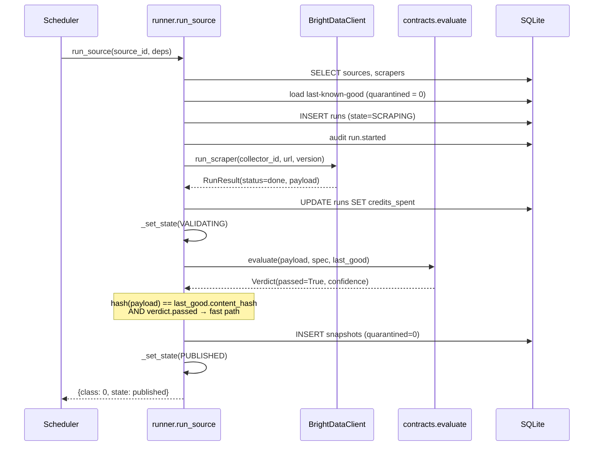
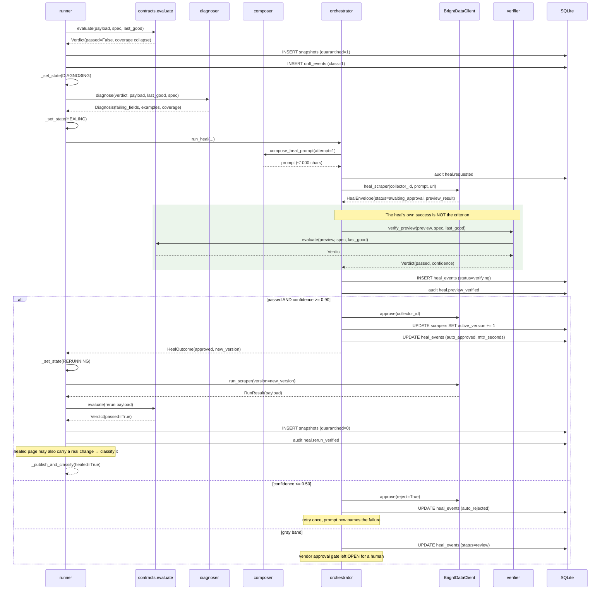
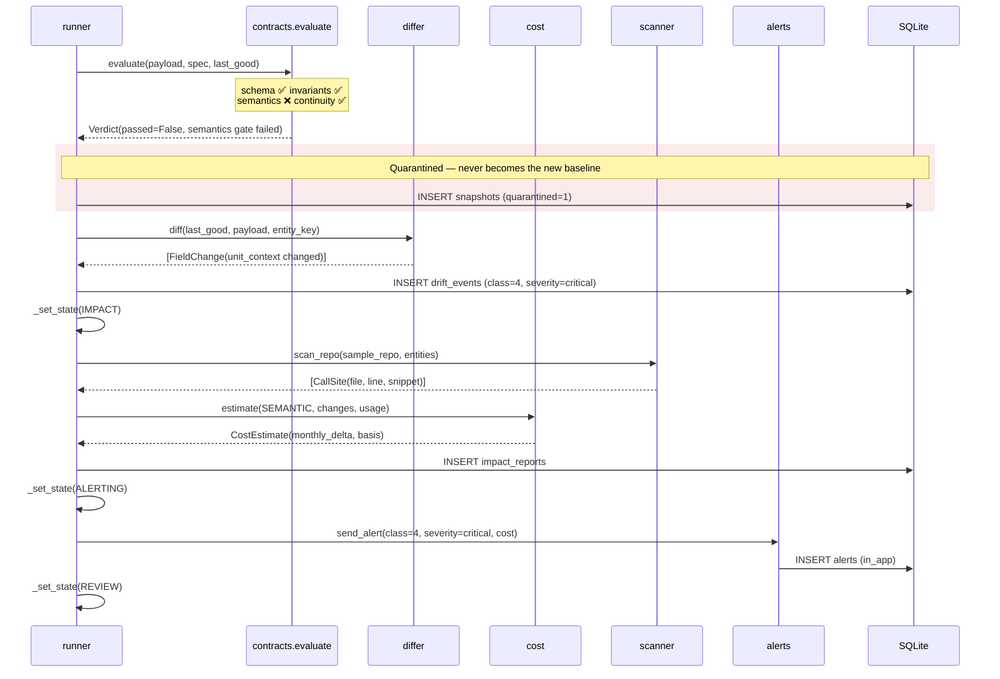
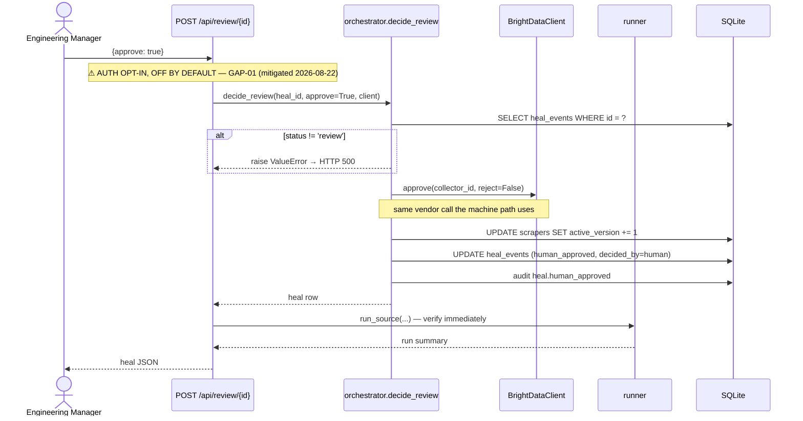
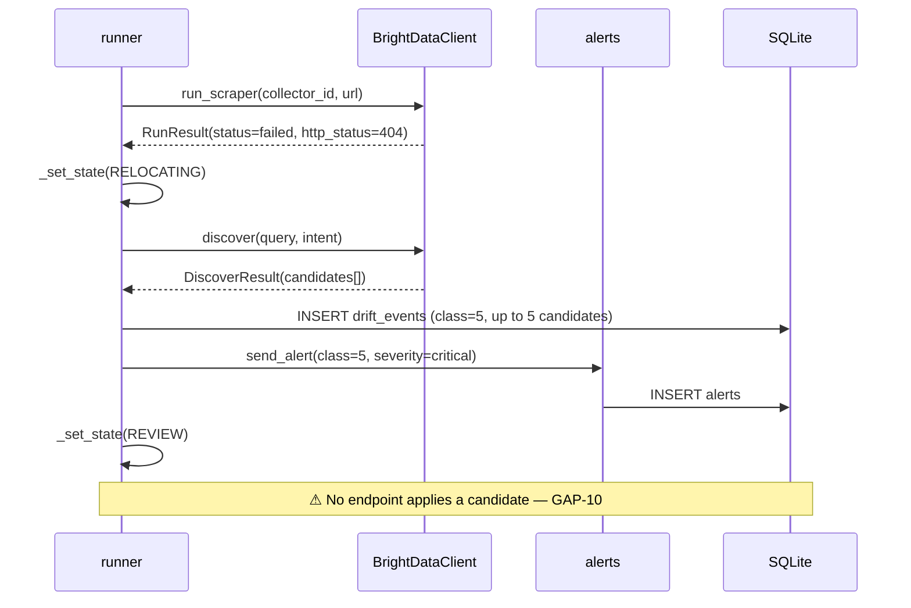
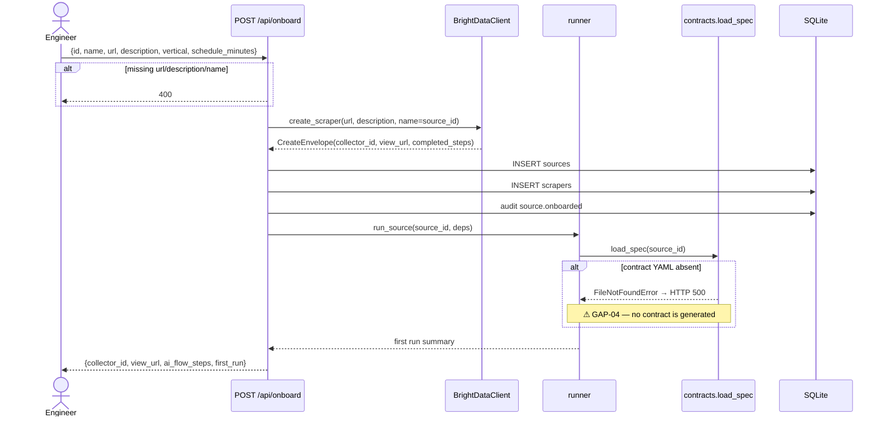

# Sequence Diagrams

[← Documentation index](../README.md) · [← HLD](HLD.md)

---

Each diagram reflects the implementation. Every participant is a real module.

---

## SD-1 — Steady state: unchanged page (Class 0)

The cheapest path. Measured p50 **6.08 ms**.

No diff, no classification, no event. **Verified:** `v1_baseline` → `class: 0, state: published`.

---

## SD-2 — Structural break → autonomous heal (Class 1)

The headline loop. Measured p50 **12.22 ms** for the full cycle.

Two design points visible here:

1. The **green block** is the thesis. Verification calls the same `evaluate()` that detected the break.
2. After a successful heal the pipeline does **not** stop — it re-classifies, because a redesigned page may also carry a genuine data change.

**Verified:** `v2_redesign` → `class: 1, state: published, healed: true`.

---

## SD-3 — Semantic drift (Class 4) — the catch that matters

The value never changed, so continuity passes and no statistical method would fire. Only the anchor assertion catches it.

**Verified:** `v3_semantic` → `class: 4, state: review`.

---

## SD-4 — Human review of a gray-band heal

Two observations:

- Machine and human converge on `client.approve()` — one vendor integration, two provenances.
- The `ValueError` for a non-review heal surfaces as an unhandled **500**, not a 409. See [API Error Catalog](../05_API/API_Error_Catalog.md).

---

## SD-5 — Page disappears (Class 5)

**Verified:** `v5_gone` → `class: 5, state: review`.

---

## SD-6 — Onboarding

This diagram documents a **broken** flow deliberately. For any genuinely new source, the run raises because no contract exists.

---

**Next:** [Data Flow Diagrams](Data_Flow_Diagrams.md) · [ADRs](ADRs/README.md) · [API Documentation](../05_API/API_Documentation.md)
