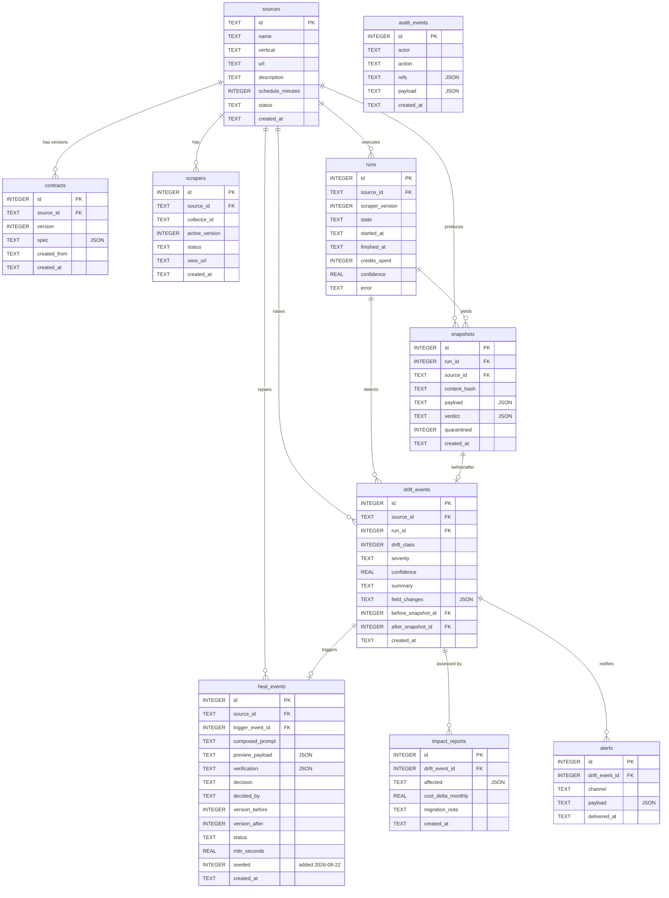

# Database Design

[← Documentation index](../README.md)

---

**Engine:** SQLite, WAL journal mode, `foreign_keys=ON`, one connection per thread.
**Schema source:** `backend/driftwatch_engine/db.py :: SCHEMA` (single `executescript`).
**Tables:** 10.

---

## ER diagram



---

## Data dictionary — semantically significant fields

Only fields whose meaning is not obvious from the name.

### `snapshots.quarantined` — the integrity flag
`0` or `1`. **The single most important column in the schema.** `_last_good()` filters on `quarantined = 0`, so a quarantined snapshot can never become a comparison baseline, appear as `latest_snapshot`, or reach a consumer. This column is how "the dashboard cannot lie" is enforced.
Evidence: `pipeline/runner.py :: _last_good`; `api/app.py :: source_detail`

### `snapshots.content_hash`
First 16 hex chars of SHA-256 over the canonically serialised payload. Enables the Class-0 fast path without a diff. **64-bit truncation** — collision risk is negligible at this scale but is a deliberate shortening, not a full digest.
Evidence: `runner.py :: _hash`

### `snapshots.verdict` (JSON)
Serialised `Verdict`: `passed`, `confidence`, per-gate results, `failing_fields`. Persisting the full verdict means a historical decision can be re-examined without re-running the contract.

### `drift_events.drift_class`
`0` none · `1` structural · `2` benign · `3` material · `4` semantic · `5` availability. Stored as INTEGER; `CLASS_LABELS` maps to display strings at the API layer.

### `heal_events.decision` / `decided_by`
`decision` ∈ `auto_approved` · `auto_rejected` · `human_approved` · `human_rejected` · `NULL` (pending). `decided_by` ∈ `machine` · `human`.

> **Integrity warning.** `decided_by = 'human'` is written whenever `POST /api/review/<id>` is called. That endpoint is unauthenticated **by default** (an opt-in bearer-token gate exists as of 2026-08-22 — `DW_API_TOKEN`), so unless it is configured, this column still records a claim the system cannot substantiate. See [GAP-01](../02_Requirements/Requirements_Gap_Analysis.md#gap-01--no-authentication-on-any-endpoint).

### `heal_events.mttr_seconds`
`time.monotonic()` delta across the heal cycle, written only on the auto-approve path.

### `heal_events.seeded`
**Added 2026-08-22.** `1` for the one demo-history row `seed.py` writes with a hardcoded `mttr_seconds = 42.3`; `0` for every real heal. `/api/stats` filters `heal_mttr_seconds` on `seeded = 0`.

> **Provenance warning — resolved 2026-08-22.** `seed.py` still inserts one row with a hardcoded `42.3`, now flagged `seeded = 1` as a real column rather than a ledger-only marker. `/api/stats` now filters on it directly, so seeded and measured values are distinguishable downstream (previously the API stripped the marker and averaged both together — see [GAP-18](../02_Requirements/Requirements_Gap_Analysis.md)).
> Evidence: `seed.py` (`"seeded": 1`), `db.py :: SCHEMA`, `api/app.py :: stats`

### `heal_events.version_before` / `version_after`
Records the template version transition. `version_after` stays `NULL` for rejected heals — that NULL *is* the rollback record.

### `runs.credits_spent`
Bright Data credits (1 per page load). Recorded per run. **Never summed against `Settings.credit_budget`** — the budget is parsed but not enforced (GAP-06).

### `audit_events.actor`
`machine` · `human` · `scheduler`. The provenance dimension of the ledger.

### `contracts.created_from`
`seed` · `auto_draft` · `manual`. **`auto_draft` is never written** — it reserves a capability that does not exist (GAP-04).

---

## Relationships and integrity

**Declared foreign keys** (enforced — `PRAGMA foreign_keys=ON` per connection):

| Child | Parent |
|---|---|
| `contracts.source_id` → `sources.id` |
| `scrapers.source_id` → `sources.id` |
| `runs.source_id` → `sources.id` |
| `snapshots.run_id` → `runs.id`, `snapshots.source_id` → `sources.id` |
| `drift_events.source_id` → `sources.id`, `.run_id` → `runs.id` |
| `heal_events.source_id` → `sources.id`, `.trigger_event_id` → `drift_events.id` |
| `impact_reports.drift_event_id` → `drift_events.id` |
| `alerts.drift_event_id` → `drift_events.id` |

**Undeclared references — a real gap:**

| Column | Should reference | Status |
|---|---|---|
| `drift_events.before_snapshot_id` | `snapshots.id` | **No FK declared** |
| `drift_events.after_snapshot_id` | `snapshots.id` | **No FK declared** |

Both are used as snapshot IDs by `api/app.py :: event_detail` but carry no constraint. Nothing prevents a dangling reference.

**Also note:** `impact_reports` is written with `drift_event_id = event_id or 0` in the material-change path. If `event_id` were ever `None`, this writes `0` — a value no `drift_events` row can have, which **would violate the declared FK and raise**. Unreachable today (a material classification always creates an event first), but it is a latent constraint violation rather than a silent orphan.
Evidence: `runner.py :: _publish_and_classify`

**Not enforced anywhere:**
- `audit_events` append-only — guaranteed only by the absence of UPDATE/DELETE code, not by a trigger or permission (FR-028)
- Enum-valued TEXT columns (`state`, `severity`, `decision`, `status`, `channel`, `actor`) have **no CHECK constraints**; validity is a Python-layer convention

---

## Indexing analysis

**RESOLVED 2026-08-22.** 8 indexes now exist (`db.py :: SCHEMA`), added as part of the same pass that fixed R-11/busy_timeout. The analysis below is preserved as the record of the reasoning; the "Current" column has been updated to reflect what shipped.

Every query pattern in the codebase and the index it wants:

| Query | Frequency | Current (2026-08-22) | Originally recommended |
|---|---|---|---|
| `snapshots WHERE source_id=? AND quarantined=0 ORDER BY id DESC LIMIT 1` | **Every run** | ✅ `idx_snapshots_source_quarantined (source_id, quarantined)` | `(source_id, quarantined, id DESC)` |
| `runs WHERE source_id=? ORDER BY id DESC LIMIT 1` | Every scheduler tick × sources | ✅ `idx_runs_source_id (source_id)` | `(source_id, id DESC)` |
| `scrapers WHERE source_id=?` | Every run | ✅ `idx_scrapers_source_id (source_id)` | `(source_id)` |
| `drift_events WHERE source_id=? ORDER BY id DESC` | UI | ✅ `idx_drift_events_source_id (source_id)` | `(source_id, id DESC)` |
| `heal_events WHERE source_id=?` | Timeline | ✅ `idx_heal_events_source_id (source_id)` | *(not in the original list — added because `api/app.py :: timeline` hits it)* |
| `heal_events WHERE status='review'` | Review queue poll | ✅ `idx_heal_events_status (status)` | `(status)` |
| `heal_events WHERE trigger_event_id=?` | Event detail | ✅ `idx_heal_events_trigger_event_id (trigger_event_id)` | `(trigger_event_id)` |
| `contracts WHERE source_id=? ORDER BY version DESC LIMIT 1` | Source detail, onboarding check | ✅ `idx_contracts_source_id (source_id)` | *(not in the original list)* |
| `impact_reports WHERE drift_event_id=?` | Event detail | ❌ Full scan — **still open** | `(drift_event_id)` |
| `alerts WHERE drift_event_id=?` | Event detail | ❌ Full scan — **still open** | `(drift_event_id)` |
| `audit_events ORDER BY id DESC LIMIT ?` | Ledger | PK backward scan | adequate, no index needed |

**What shipped is a simplification of what was recommended, not an exact match**, and it is worth being precise about the gap: the original recommendation called for **compound indexes ending in `id DESC`** (e.g. `(source_id, quarantined, id DESC)`), which let SQLite answer `ORDER BY id DESC LIMIT 1` with zero sort step. What shipped is **single/two-column indexes without the trailing sort column** (e.g. `(source_id, quarantined)`), which eliminate the full-table scan — the dominant cost — but leave a small in-memory sort over the matching rows for that source, typically a handful of rows in this system's data shapes. This is a legitimate 80/20 trade-off (8 simple `CREATE INDEX IF NOT EXISTS` lines vs. hand-tuning column order and sort direction per query), not an oversight, but a future pass tightening these to match the original compound-index recommendation would still have measurable value on the two hottest queries (`snapshots`, `runs`) as data volume grows.

**Still open:** `impact_reports(drift_event_id)` and `alerts(drift_event_id)` were recommended but not added in this pass — both back `GET /api/events/<id>`, a lower-frequency read path than the pipeline's own hot loop, so they were deprioritised. ~10 minutes to add if this matters at your data volume.

**Current impact: negligible either way.** Measured p50 6.08 ms with a seeded DB (103 runs), before any of these indexes existed. **Growth behaviour is linear without them** — at 100 sources × hourly runs, `snapshots` reaches ~876k rows/year and the un-indexed query would have degraded proportionally; the added indexes remove that degradation for the columns covered above.

```sql
-- As implemented in db.py :: SCHEMA (2026-08-22):
CREATE INDEX IF NOT EXISTS idx_runs_source_id ON runs(source_id);
CREATE INDEX IF NOT EXISTS idx_snapshots_source_quarantined ON snapshots(source_id, quarantined);
CREATE INDEX IF NOT EXISTS idx_drift_events_source_id ON drift_events(source_id);
CREATE INDEX IF NOT EXISTS idx_heal_events_source_id ON heal_events(source_id);
CREATE INDEX IF NOT EXISTS idx_heal_events_status ON heal_events(status);
CREATE INDEX IF NOT EXISTS idx_heal_events_trigger_event_id ON heal_events(trigger_event_id);
CREATE INDEX IF NOT EXISTS idx_contracts_source_id ON contracts(source_id);
CREATE INDEX IF NOT EXISTS idx_scrapers_source_id ON scrapers(source_id);
```

---

## Transactions and concurrency

**Every write is its own transaction.** `db.insert()` and `db.update()` each call `conn.commit()` immediately. There is no multi-statement transaction anywhere.

Consequences:

1. **State change and audit write are not atomic.** `_set_state()` performs two independent commits. A crash between them leaves a run advanced with no audit record — a hole in the integrity claim.
2. **A pipeline run is not atomic.** A crash mid-run leaves a `runs` row in a non-terminal state (`SCRAPING`, `HEALING`…) forever. No startup reconciliation exists.
3. **Two threads write concurrently.** Flask request threads and the scheduler thread hold separate connections. WAL allows one writer; a collision now waits and retries for up to 5s (`PRAGMA busy_timeout=5000`, added 2026-08-22) before raising `database is locked`, rather than raising immediately.

**RECOMMENDED (remaining)**
- ~~`PRAGMA busy_timeout=5000` in `_connect()`~~ — **done 2026-08-22**
- Wrap `_set_state()`'s two writes in one transaction
- Reconcile non-terminal runs to `FAILED` at startup

---

## Migrations

**NOT IMPLEMENTED.** `configure()` runs `executescript(SCHEMA)` with `CREATE TABLE IF NOT EXISTS`. Adding a column to an existing database requires manual `ALTER TABLE`; there is no version table, no migration runner, and no downgrade path.

Acceptable for a reference build that recreates its database (`make clean`). Blocking for anything with retained data.

---

## Data volume and retention

| Table | Growth | Retention |
|---|---|---|
| `runs` | 1 per source per schedule interval | **Unbounded** |
| `snapshots` | 1–2 per run | **Unbounded** — largest table (full payload JSON per row) |
| `audit_events` | ~8–15 per run | **Unbounded** — fastest-growing |
| `drift_events` | Only on change | Unbounded |
| `heal_events` | Only on structural drift | Unbounded |

**No retention, archival, or pruning policy exists.** For 100 sources at hourly cadence, `audit_events` reaches roughly 10M rows/year. Since the ledger is the integrity story, deleting from it conflicts with the append-only claim — the right answer is partitioning or cold archival, and neither is designed. **NOT IMPLEMENTED.**

---

## Backup and recovery

**NOT IMPLEMENTED.** No backup script, no `VACUUM INTO`, no documented restore procedure. The database is a single file; recovery means file-level copy. **RPO and RTO are not established.**
See [Reliability & Failure Design](../10_Operations/Reliability_and_Failure_Design.md#disaster-recovery).

---

**Next:** [API Documentation](../05_API/API_Documentation.md) · [LLD § Persistence](../03_Architecture/LLD.md#5-persistence-layer)
