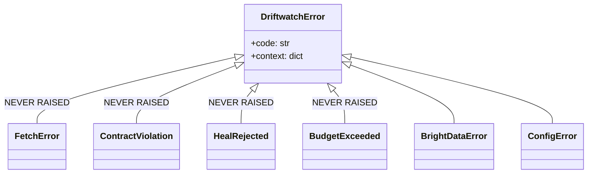

# API Error Catalog

[← Documentation index](../README.md) · [← API Documentation](API_Documentation.md)

---

## The core finding

The codebase defines a careful typed error taxonomy in `errors.py` — and **the API layer does not use it.** Verified by grep across `apps/`:

| Exception class | Times raised | Where |
|---|---|---|
| `DriftwatchError` (base) | 0 | — |
| `FetchError` | **0** | never raised |
| `ContractViolation` | **0** | never raised |
| `HealRejected` | **0** | never raised |
| `BudgetExceeded` | **0** | never raised |
| `BrightDataError` | 3 | `live.py:40,44`, `replay.py:96` |
| `ConfigError` | 2 | `live.py:27,29` |

Four of seven classes are dead code, and `errors.py`'s docstring claims *"Every failure mode the pipeline can hit maps to one of these classes, and every one of them maps to a visible pipeline state — no silent log-line failures."* That statement is false as written. See [GAP-05](../02_Requirements/Requirements_Gap_Analysis.md#gap-05--error-taxonomy-is-dead-code).

**There is no Flask error handler registered anywhere.** No `@app.errorhandler`. Any uncaught exception produces Flask's default 500 HTML page, not a JSON envelope — so an API client receives HTML when things go wrong.

---

## Errors actually returned

### Handled — structured JSON

| Code | Endpoint | Body | Trigger |
|---|---|---|---|
| `400` | `POST /api/demo/state` | `{"error": "variant must be one of [...]"}` | Variant not in allowlist |
| `400` | `POST /api/onboard` | `{"error": "url, description and name are required"}` | Missing required field |
| `404` | `GET /api/sources/<id>` | `{"error": "unknown source"}` | No such source |
| `404` | `GET /api/events/<id>` | `{"error": "unknown event"}` | No such event |
| `404` | `GET /mirror/<id>` | `<h1>404 — page moved</h1>` | Variant is `v5_gone` (**intentional**) |
| `404` | `GET /mirror/<id>` | `no mirror page for <id>/<variant>` | Fixture missing |

### Unhandled — Flask default 500 HTML

Every row below is a case where a specific status code would be correct.

| Actual | Should be | Endpoint | Trigger | Evidence |
|---|---|---|---|---|
| `500` | `404` | `POST /api/run/<id>` | Unknown source → `ValueError` | `runner.py:99` |
| `500` | `409` | `POST /api/review/<id>` | Heal not awaiting review → `ValueError` | `orchestrator.py:128` |
| `500` | `404` | `POST /api/review/<id>` | Unknown heal id → same `ValueError` | `orchestrator.py:128` |
| `500` | `422` | `POST /api/onboard` | Contract YAML absent → `FileNotFoundError` | `engine.py :: load_spec` |
| `500` | `400` | `GET /api/events?limit=abc` | Non-numeric limit → `ValueError` | `api/app.py :: events` |
| `500` | `400` | any POST | Malformed JSON body → `get_json(force=True)` raises | all POST routes |
| `500` | `502` | any run in live mode | Vendor CLI non-zero exit → `BrightDataError` | `live.py:40` |
| `500` | `502` | any run in live mode | Vendor returns non-JSON → `BrightDataError` | `live.py:44` |
| `500` | `500` | replay mode | Missing fixture → `BrightDataError` | `replay.py:96` |
| `500` | `503` | startup in live mode | Missing key or CLI → `ConfigError` | `live.py:27,29` |

**The `POST /api/onboard` case is the most damaging**, because the failure is not clean: `sources` and `scrapers` rows are already committed and a Scraper Studio collector has already been created (consuming credits) before the exception fires. The caller receives an HTML 500 and is left with orphaned rows and a paid-for collector.

---

## Error taxonomy as designed

`errors.py` intends this structure. It is documented here as **design intent**, not behaviour.



Each carries a stable machine-readable `code` intended for the audit ledger. Since four are never raised, those codes never reach the ledger.

---

## Recommended remediation

**RECOMMENDED — all of the following. Roughly 2 hours total.**

### 1. Register a JSON error handler

```python
@app.errorhandler(Exception)
def handle(exc):
    if isinstance(exc, DriftwatchError):
        return jsonify({"error": str(exc), "code": exc.code, "context": exc.context}), STATUS[exc.code]
    if isinstance(exc, HTTPException):
        return jsonify({"error": exc.description, "code": "http_error"}), exc.code
    return jsonify({"error": "internal error", "code": "internal_error"}), 500
```

### 2. Raise the typed errors that already exist

| Site | Replace | With |
|---|---|---|
| `runner.py:99` | `ValueError(f"unknown source ...")` | `SourceNotFound` (new) or `DriftwatchError` |
| `orchestrator.py:128` | `ValueError(f"heal event ... not awaiting review")` | `HealRejected` |
| `engine.py :: load_spec` | uncaught `FileNotFoundError` | `ContractViolation` |
| before `run_scraper` | — | `BudgetExceeded` when credits exhausted (GAP-06) |

### 3. Make onboarding transactional
Validate the contract exists **before** calling `create_scraper()`. That single reordering removes the orphaned-row-plus-paid-collector failure entirely.

### 4. Bound `limit`
`min(int(request.args.get("limit", 100)), 1000)` inside a try/except.

---

## Proposed error-code → HTTP mapping

**RECOMMENDED**, for when the handler is added:

| `code` | HTTP | Meaning |
|---|---|---|
| `config_error` | 503 | Service misconfigured (missing key or CLI) |
| `contract_violation` | 422 | Contract missing or unloadable |
| `fetch_error` | 502 | Target page unreachable |
| `brightdata_error` | 502 | Vendor API/CLI failure |
| `heal_rejected` | 409 | Heal not in a state permitting this action |
| `budget_exceeded` | 429 | Credit ceiling reached |
| `driftwatch_error` | 500 | Uncategorised internal |

---

**Next:** [Security Architecture](../06_Security/Security_Architecture.md) · [Reliability](../10_Operations/Reliability_and_Failure_Design.md)
