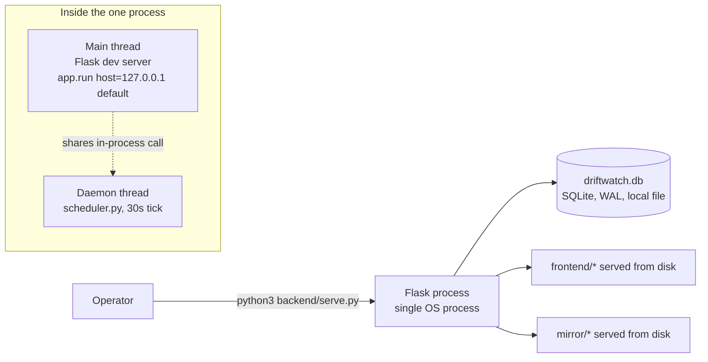

# Deployment Architecture

[← Documentation index](../README.md) · [← HLD § Deployment topology](../03_Architecture/HLD.md#10-deployment-topology)

---

> **Summary.** There is one deployment topology: a single Python process, started manually, on one machine. There is no container, no staging environment, no production environment, and no process supervisor. Everything below is either what exists today or an explicit, labelled recommendation — nothing in between.

## 1. What actually runs



One `python3 backend/serve.py` invocation produces one OS process containing two logical workers that share memory and the SQLite connection pool: the Flask HTTP server on the main thread, and the scheduler on a daemon thread. There is no second process, no message broker, and no network hop between them.
Evidence: `backend/serve.py`, `api/app.py :: serve()`, `scheduler.py :: start()`

## 2. Startup sequence

Evidence: `api/app.py :: serve()`

1. `db.configure(settings.db_path)` — opens the SQLite file, runs `CREATE TABLE IF NOT EXISTS` for all 10 tables (idempotent; no migration step).
2. `seed.seed_all()` — inserts the two demo sources and a 12-day fabricated history, idempotently: `ensure_sources()` skips any source ID already present, and `seed_history()` returns immediately if any run already exists. `make demo` additionally deletes the DB file first, so a demo run always starts from the same seeded world.
Evidence: `seed.py :: ensure_sources`, `seed_history`
3. `WorldState()` constructed and seeded with `seed.CURRENT_VARIANTS` — in-memory only, lost on restart.
4. `create_app(settings, world)` — builds the Flask app and its single shared `Deps` (client, provider, settings).
5. `start_scheduler(build_deps(...))` — spawns the daemon thread; it builds a **second, independent** `Deps` object via a second `build_deps()` call rather than reusing the API's `Deps`. Both point at the same `WorldState` and the same SQLite file, so behaviourally they act as one, but it is two client instances (two `ReplayClient` or `LiveClient` objects, each with independent `credits_spent` counters) — worth noting as a minor inconsistency, not a defect: nothing in the codebase reads either instance's `credits_spent` attribute.
6. `app.run(host=settings.host, port=settings.port, debug=False)` — blocks the main thread forever; this **is** the server. `settings.host` defaults to `127.0.0.1` (fixed 2026-08-22, was hardcoded `0.0.0.0`); set `DW_HOST=0.0.0.0` to opt back into binding all interfaces.

## 3. Environments

**One environment exists.** There is no `ENVIRONMENT=staging|production` distinction, no per-environment config file, and no environment-specific deployment target. The only runtime fork is `DW_MODE`:

| `DW_MODE` | Bright Data client | Network calls | Intended use |
|---|---|---|---|
| `replay` (default) | `ReplayClient` | None — fixtures + self-hosted mirror | Tests, demo, offline development |
| `live` | `LiveClient` | Real Bright Data CLI subprocess | **UNVALIDATED** — see [AI Architecture § Live-path validation status](../09_AI_ML/AI_Architecture.md#live-path-validation-status) |

**NOT IMPLEMENTED:** staging environment, production environment, environment promotion, per-environment secrets, blue/green or canary deployment.

## 4. Configuration and secrets

Evidence: `config.py`, `.env.example`

All configuration is environment variables, loaded through a minimal stdlib `.env` parser (`_load_dotenv`) that never overrides a variable already set in the real environment. `.env` is git-ignored; `SEC-003` (secrets not committed) is **IMPLEMENTED** and independently verified absent from git history (see [Requirements Traceability Matrix](../02_Requirements/Requirements_Traceability_Matrix.md)).

| Variable | Default | Required when |
|---|---|---|
| `DW_MODE` | `replay` | — |
| `DW_DB_PATH` | `<repo>/driftwatch.db` | — |
| `DW_HOST` | `127.0.0.1` | Set `0.0.0.0` explicitly to expose beyond localhost — added 2026-08-22, was hardcoded `0.0.0.0` |
| `DW_PORT` | `8000` | — |
| `DW_API_TOKEN` | none | Optional — added 2026-08-22; requires `Authorization: Bearer <token>` on `/api/*` when set. Unset preserves the original open-demo behaviour |
| `DW_CREDIT_BUDGET` | `4500` | Parsed, **never enforced** — [Gap Report G-06](../11_Assessment/Engineering_Gap_Report.md) |
| `BRIGHTDATA_API_KEY` | none | `DW_MODE=live` — `LiveClient.__init__` raises `ConfigError` if absent |
| `ANTHROPIC_API_KEY` | none | Optional; absence silently selects `HeuristicProvider` |
| `DW_SLACK_WEBHOOK` | none | Optional; absence silently disables the Slack alert channel |

There is no secrets manager, no encryption at rest for the `.env` file, and no key rotation mechanism. **This is defensible for a localhost demo and not defensible beyond it** — consistent with [ADR-009](../03_Architecture/ADRs/README.md#adr-009--no-authentication-in-the-reference-build). The two rows above (`DW_HOST`, `DW_API_TOKEN`) mean the operator now controls that trade-off explicitly rather than it being hardcoded.

## 5. Networking

- **Server binds `127.0.0.1` by default (fixed 2026-08-22, was hardcoded `0.0.0.0`)** — `DW_HOST=0.0.0.0` opts in explicitly to all interfaces (`api/app.py :: serve()`; the `# noqa: S104` waiver this used to carry is gone along with the hardcoded literal).
- No TLS. No reverse proxy. No load balancer. Plain HTTP on `DW_PORT` (default 8000).
- No domain, no DNS configuration — access is by IP/hostname and port only.
- The SPA, the JSON API, and the demo mirror site are served from the **same origin** by the same Flask app (`send_from_directory` for `/`, `/assets/*`, and `/mirror/*`), which is why there is no CORS configuration anywhere in the codebase — none is needed for the reference build's own frontend, and none exists for any other origin.

## 6. Process model

| Property | State |
|---|---|
| Application server | Flask's built-in development server (`app.run`) — Flask's own documentation states this is not production-suitable |
| WSGI/ASGI server (gunicorn, uwsgi, waitress) | **NOT IMPLEMENTED** |
| Process supervisor (systemd, supervisord, pm2) | **NOT IMPLEMENTED** — killing the process ends the scheduler with it (see [ADR-010](../03_Architecture/ADRs/README.md#adr-010--in-process-thread-scheduler-the-runs-table-is-the-queue)) |
| Restart-on-crash | **NOT IMPLEMENTED** |
| Graceful shutdown / SIGTERM handling | **NOT IMPLEMENTED** — no signal handler; an in-flight run is abandoned mid-state on kill |
| Horizontal scaling | **NOT POSSIBLE as built** — SQLite is single-writer ([ADR-002](../03_Architecture/ADRs/README.md#adr-002--sqlite-as-the-only-datastore)) and the scheduler has no leader election, so a second replica would double-run every source |

## 7. Containerisation

**NOT IMPLEMENTED.** No `Dockerfile`, no `docker-compose.yml`, no `.dockerignore`, no Kubernetes manifests exist anywhere in the repository (verified by directory listing at the repository root and under every `apps/*` subtree). "Reproducible by judges" rests entirely on `pip install -r requirements.txt` and a compatible local Python ≥ 3.10 — see [Scope § Constraints](../01_Product/Scope.md).

## 8. Running it today

```bash
pip install -r requirements.txt
make demo    # rm -f driftwatch.db* ; python3 backend/serve.py
# http://localhost:8000
```

`make test` and `make lint` run the same way, locally, with no infrastructure dependency — this is a genuine strength: the entire product (pipeline, healing, API, 23 tests) requires nothing beyond Python and five pure-Python/HTTP-client packages. See [Scope § Dependencies](../01_Product/Scope.md#dependencies).

## 9. RECOMMENDED — production deployment shape

Items 1, 3–5, and 7 do not exist and remain engineering recommendations, not a description of the system. Item 2 is partially in place: a WSGI server is still not used, but the default bind and an opt-in auth gate — item 6, below — shipped 2026-08-22.

1. **Containerise.** A `Dockerfile` (Python 3.11-slim base, `pip install -r requirements.txt`, `COPY`, non-root user) removes the "works on my machine" risk entirely. ~2 hours.
2. **Replace the dev server.** `gunicorn --workers N --timeout 900 driftwatch_engine.api.app:app` (or move `LiveClient` calls off the request thread first — a 900 s worker timeout is itself a problem; see [Reliability & Failure Design](../10_Operations/Reliability_and_Failure_Design.md)).
3. **Move the scheduler out of the web process.** A separate `scheduler` process/container reading the same database removes the coupling between "the web server is up" and "sources are being watched," and makes horizontal API scaling possible without double-scheduling.
4. **Swap SQLite for Postgres for anything beyond one writer.** `db.py`'s own docstring states this is "a driver change, not a redesign — the schema is vanilla SQL," which is a genuine, verifiable engineering property, not aspiration.
5. **Put a reverse proxy in front.** TLS termination, request size limits, and a real access log belong at this layer (nginx or Caddy), not in Flask.
6. ~~**Bind `127.0.0.1` by default**; require an explicit flag to bind `0.0.0.0`. Pairs with authentication.~~ **Done 2026-08-22** — `DW_HOST` defaults to `127.0.0.1`; `DW_API_TOKEN` gates every non-public route when set. See [Security Architecture](../06_Security/Security_Architecture.md).
7. **Add health/readiness endpoints** and wire them to the process supervisor and reverse proxy. See [Observability § Gaps](../10_Operations/Observability.md).

None of this is required for the system's demonstrated engineering thesis (the contract → heal → verify loop), which is fully exercised in the current single-process topology. It is required before the system is exposed to any network it does not fully trust.

---

**Next:** [CI/CD](CI_CD.md) · [Reliability & Failure Design](../10_Operations/Reliability_and_Failure_Design.md)
