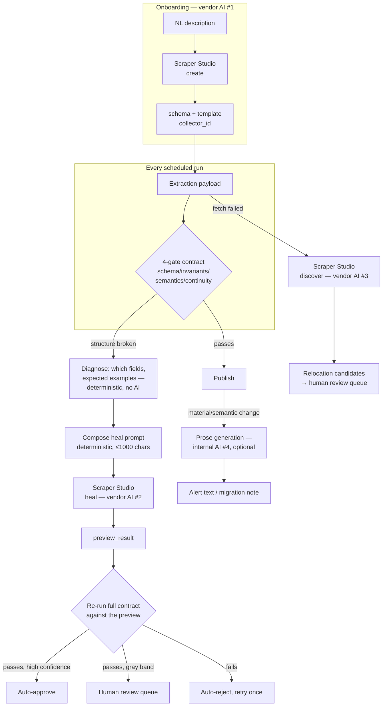

# AI Architecture

[← Documentation index](../README.md) · [← ADR-006](../03_Architecture/ADRs/README.md#adr-006--llm-confined-to-prose-behind-a-protocol-defaulting-off)

---

> **Framing.** This system contains two categories of AI that must not be conflated. **Vendor AI** (Bright Data Scraper Studio) generates and repairs executable extraction logic — a high-stakes capability that DriftWatch never trusts blindly. **Internal AI** (an optional Anthropic model) generates prose only, behind an interface that makes it structurally incapable of influencing any decision. Confusing the two — as marketing language for "AI-powered" products often does — would misrepresent both the risk and the engineering.

## 1. Model inventory

| # | Component | Provider | Model | Purpose | Decision authority |
|---|---|---|---|---|---|
| 1 | Scraper creation (AI Flow) | Bright Data Scraper Studio (vendor, opaque) | Not disclosed by the vendor | Turns a natural-language description + URL into an extraction schema and template (`collector_id`) | Output is never trusted as-is — every extraction it produces is re-checked against DriftWatch's own contract on every run |
| 2 | Scraper healing | Bright Data Scraper Studio (vendor, opaque) | Not disclosed by the vendor | Regenerates a broken extraction template from a text prompt | **Never** trusted on its own success report — the preview is re-evaluated against the full contract before approval ([`healing/verifier.py`](../03_Architecture/LLD.md)) |
| 3 | Page discovery | Bright Data Scraper Studio (vendor, opaque) | Not disclosed by the vendor | Proposes relocation candidates when a watched page 404s | Surfaced to a human review queue; nothing auto-applies a candidate ([Gap Report G-10](../11_Assessment/Engineering_Gap_Report.md)) |
| 4 | Prose generation | Anthropic (internal, optional) | `claude-sonnet-4-5` (hardcoded default) | Upgrades alert summaries and migration notes from deterministic templates to model-quality prose | **None** — return type is `str`; nothing downstream branches on it |
| 5 | Prose generation (default) | None | — | `HeuristicProvider` — deterministic string templates, always available, no network | **None** |

Evidence: `brightdata/protocol.py`, `brightdata/live.py`, `llm/provider.py`

Items 1–3 are used identically whether `DW_MODE` is `replay` (a faithful fixture simulation, [ADR-004](../03_Architecture/ADRs/README.md#adr-004--protocol-seam-for-bright-data-with-a-faithful-replay-implementation)) or `live` (the real vendor API via CLI) — see [§ Live-path validation status](#live-path-validation-status) for which of those has actually been exercised.

## 2. Pipeline architecture



**The only components in this diagram that are themselves AI are `create`, `heal`, `discover` (vendor, boxes 1–3) and the optional prose step (box 4).** Diagnosis, prompt composition, contract evaluation, drift classification, verification, and the approval decision are all deterministic code — no model call sits on the decision path. This is the load-bearing claim of [ADR-006](../03_Architecture/ADRs/README.md#adr-006--llm-confined-to-prose-behind-a-protocol-defaulting-off) and the strongest AI-safety property in the system.

## 3. Prompt architecture

### 3.1 The heal prompt (sent to vendor AI #2)

Composition is entirely deterministic — no AI writes this prompt.
Evidence: `healing/composer.py :: compose_heal_prompt`

Built from a `Diagnosis` (`healing/diagnoser.py`): the failing field paths, the coverage percentage, and up to 4 example values pulled from the last-known-good snapshot. Template:

```
After a page redesign on {source_name}, these fields fail extraction: {fields}.
Field coverage fell to {coverage:.0%}.
Previously valid values looked like: {examples}.
Fix the template so every field extracts with the same schema and JSON field
names as before; numeric fields must be plain numbers (no currency symbols),
and keep the unit_context fields populated with the visible pricing-unit text
next to each value.
```

On a second attempt (after an auto-rejected first heal), one more sentence is appended naming the specific gate failures from the rejected preview. The composed string is truncated on a word boundary if it exceeds `heal_prompt_max_chars` (1000, Bright Data's documented limit) — validated by `test_healing.py::test_prompt_is_specific_and_within_limit`.

**Untrusted input in this prompt:** `expected_examples` values come verbatim from the last-known-good extraction — i.e., from a third-party web page. Neither `composer.py` nor anything upstream escapes, delimits, or sanitises them before f-string interpolation. This is the mechanism behind [Threat Model T-08](../06_Security/Threat_Model.md#t-08-in-depth--the-ai-specific-threat-that-matters) — see § 5 below.

### 3.2 The Anthropic prompts (internal AI #4)

Evidence: `llm/provider.py :: AnthropicProvider`

Two prompts, both one-shot (no conversation, no system prompt, no tool use):

| Method | Max tokens | Shape |
|---|---|---|
| `drift_summary` | 120 | "One crisp sentence for an engineering alert. Drift class: {label}. Deterministic summary: {base}. Field changes: {first 5, as JSON}. No preamble." |
| `migration_note` | 400 | "Write a terse migration note (≤8 bullet lines)... Change class: {label}. Changes: {first 5}. Affected call sites: {first 8}. Cost basis: {basis}." |

Both interpolate `change.before`/`change.after` values — again, third-party page content — directly into the prompt with no delimiting. The blast radius here is bounded by design: the return type is `str`, consumed only as display text, so a successful injection can at worst produce misleading *prose*, never a state change. See [Security Architecture § AI safety](../06_Security/Security_Architecture.md).

No system prompt, temperature, or `top_p` is set on the Anthropic request — the API's defaults apply implicitly. This is **UNVALIDATED**: nothing in the codebase or test suite pins or checks generation parameters, so prose style could vary between calls to the same model.

### 3.3 Retry and fallback behaviour

| Layer | Retry | Fallback |
|---|---|---|
| Heal (vendor AI #2) | Exactly one retry with a refined prompt on auto-reject; no retry on the gray-band or second-rejection path | Second rejection → quarantine, no further attempt (see [Model Limitations](Model_Limitations.md)) |
| Anthropic call (`_complete`) | **None** | Any exception (network, auth, schema change, timeout) → caught by a blanket `except Exception` → returns `None` → caller falls back to `HeuristicProvider`'s deterministic template via `super()` |

The Anthropic fallback is structural, not a written policy: `AnthropicProvider` *inherits* from `HeuristicProvider`, so `super().drift_summary(...)` is always available with zero extra code. **This fallback is itself UNVALIDATED** — no test constructs an `AnthropicProvider` and forces `_complete` to fail to confirm the `super()` path actually engages (`REL-003` in the [Requirements Traceability Matrix](../02_Requirements/Requirements_Traceability_Matrix.md)). It is also **silent**: unlike `alerts.py`'s Slack failure path, which writes `db.audit("machine", "alert.slack_failed", ...)`, `_complete`'s `except Exception: return None` writes nothing to the ledger. An operator has no way to see, from the audit trail, that prose degraded from model-quality to heuristic on a given run. Flagged in [Model Limitations](Model_Limitations.md).

## 4. Cost governance

| Cost | Tracked? | Enforced? |
|---|---|---|
| Bright Data credits (1 / page load, free tier 5,000/mo) | **IMPLEMENTED** — `runs.credits_spent`, summed in `/api/stats` | **NOT IMPLEMENTED** — `Settings.credit_budget` (4500) and `BudgetExceeded` exist; nothing reads or raises either ([Gap Report G-06](../11_Assessment/Engineering_Gap_Report.md)) |
| Anthropic tokens/cost | **NOT IMPLEMENTED** — no token count, no per-call or cumulative cost is recorded anywhere | **PARTIALLY** — `max_tokens` is capped per call (120 / 400), which bounds worst-case spend per call even though nothing bounds cumulative spend |

A source with many field changes in one run issues one synchronous Anthropic call per drift event (bounded by the `[:5]` slice in the prompt, not by a rate limiter). At the scale this build has ever run at, that has not mattered; it is unquantified at any larger scale.

## 5. AI safety

**What is structurally guaranteed:**
- No pipeline branch reads Anthropic's output — the `Provider` Protocol's two methods both return `str`. A manipulated or hallucinating model cannot cause a bad template to be approved, a source to be quarantined, or an alert severity to change. This is enforced by the type system, not by review discipline. Evidence: `llm/provider.py :: Provider`.
- No pipeline branch trusts the vendor heal's own success report either — `healing/verifier.py` re-runs the *entire* contract (all four gates) against the preview, and only that verdict decides approval. `test_healing.py::test_garbage_preview_is_auto_rejected_never_trusted` exists specifically to prove a heal cannot talk its way past verification.

**What is not defended:**
- **Prompt injection into the heal prompt (§3.1) is unmitigated.** The "previously valid values" text in the prompt is the *last-known-good* extraction, i.e. a payload the page itself supplied on an earlier, presumably-legitimate run — so the injection window is one run wide (a page must have been scraped once while carrying the payload for it to later surface in a heal prompt), not instantaneous, but it is real: an attacker who controls the page for even one extraction cycle can plant text that persists into every subsequent heal prompt for that field until the next successful heal. That text lands verbatim in a prompt sent to the vendor's model, which regenerates *executable extraction logic*. This is [Threat Model T-08](../06_Security/Threat_Model.md#t-08-in-depth--the-ai-specific-threat-that-matters), rated **HIGH**, and it is the one threat in the system's threat model that survives even a fully localhost-trusted deployment, because the attacker is the watched third-party page, not a network client.
- **Prompt injection into Anthropic prose (§3.2) is unmitigated but lower-severity** — bounded to misleading text, never a decision, per the structural guarantee above.
- **No adversarial testing exists for either prompt path.** No test in `test_healing.py` or elsewhere constructs a page payload containing an injection payload and asserts on the resulting prompt or on system behaviour. The threat is documented; it is not exercised.
- **No output validation on Anthropic's response beyond schema access** (`response.json()["content"][0]["text"]`) — a shape change in Anthropic's API response is caught only by the blanket exception handler in §3.3, not detected or distinguished from any other failure mode.

Full threat analysis: [Threat Model § T-08](../06_Security/Threat_Model.md).

## 6. Determinism and reproducibility

`HeuristicProvider` (the default, and the only provider exercised by any test or by the demo as documented) is **fully deterministic** — no network, no variance, byte-identical output for identical input. This is a genuine and load-bearing engineering property: it is what makes the 23-test suite and the demo script reproducible offline. `AnthropicProvider`, when enabled via `ANTHROPIC_API_KEY`, introduces real non-determinism (no seed, unset temperature) into prose for the same underlying drift event across repeated runs — expected model behaviour, but **UNVALIDATED** for consistency, and not exercised in CI (CI's dependency install has no `ANTHROPIC_API_KEY`, so `AnthropicProvider` is never constructed in the pipeline that gates merges).

## Live-path validation status

**`DW_MODE=live` is implemented and has never completed a successful run.**

What exists: `brightdata/live.py :: LiveClient` shells out to the official `brightdata`/`bdata` npm CLI (`npm i -g @brightdata/cli`) via `subprocess.run` with list-form argv (no `shell=True`), requiring `BRIGHTDATA_API_KEY`. It implements all five `BrightDataClient` Protocol methods (`create_scraper`, `run_scraper`, `heal_scraper`, `approve`, `discover`), parsing `--json` CLI output into the same Pydantic envelope types (`brightdata/envelopes.py`) that `ReplayClient` also returns — this is the seam described in [ADR-004](../03_Architecture/ADRs/README.md#adr-004--protocol-seam-for-bright-data-with-a-faithful-replay-implementation) and [ADR-005](../03_Architecture/ADRs/README.md#adr-005--wrap-the-official-cli-rather-than-calling-rest).

What does not exist: any successful invocation. No test touches `LiveClient` (verified — zero references to `LiveClient` anywhere under `apps/engine/tests/`); every test and the documented demo path run exclusively against `ReplayClient`.

**A Day-0 spike was actually run — and failed at the vendor, not in this code.** [SCRAPER_STUDIO.md](../../SCRAPER_STUDIO.md) documents the pre-kickoff spike procedure — verify the installed CLI's JSON envelopes against a toy page before relying on the parsing in `envelopes.py`. `scripts/spike_out/*.json` holds the three real, timestamped CLI transcripts that spike produced (`create.json`, `heal.json`, `approve.json`; `create.json` is dated `2026-08-22T04:30:29.717Z` — the same day as this review):

| Call | `status` | `error` | `collector_id` |
|---|---|---|---|
| `scraper create` | `ai_trigger_failed` | `"Automation not allowed"` | `c_mt3vr49h1qtwyctl1g` |
| `scraper heal` | `heal_trigger_failed` | `"Self healing tool is temporarily disabled"` | `c_msqexhu61uaxbv00x4` |
| `scraper approve` | `resume_failed` | `"Automation not found"` | `c_msqexhu61uaxbv00x4` |

All three envelopes carry `"completed_steps": []` — the AI Flow never advanced past its first step in any of the three calls. This is a real transcript with real vendor-issued `collector_id`s, which corrects an overstatement worth flagging plainly: **it is not accurate to say no evidence of a live attempt exists** — evidence exists, and it is evidence of failure at the vendor's own automation/heal gate, not of `LiveClient` never having been exercised. The `heal` error in particular — *"Self healing tool is temporarily disabled"* — reads as a vendor-side feature flag or platform-level condition on the exact capability ("Best Use of Bright Data," self-healing) this project is judged on, not obviously an account-tier misconfiguration; the `create` error ("Automation not allowed") is more consistent with an account/zone-provisioning gap. Neither has been root-caused further than the error string itself.

Stated cause: [Project Vision § OBJ-9](../01_Product/Project_Vision.md) records this as **UNVALIDATED for an account-configuration reason, not a code reason.** The spike transcript above is consistent with that framing for `create`, but the `heal` failure's wording leaves open a second possibility — a temporary vendor-side outage of the healing feature specifically — that this repository has not distinguished from an account issue. Either way, the practical consequence is the same: **the envelope-parsing assumptions in `envelopes.py` — asserted to mirror the `@brightdata/cli` README "as of Aug 2026" — remain unverified against a real *successful* response,** because every real response captured so far is an error envelope. A CLI version skew on a future successful call would surface as a `BrightDataError("CLI returned non-JSON output", ...)` or a Pydantic validation error, and nothing has exercised that specific path.

**What would retire this gap:** one successful `scraper create` → `scraper heal` → `scraper approve` transcript against a real page, per the checklist in `SCRAPER_STUDIO.md`. Performance consequence: [Performance Validation § What is not measured](../07_Testing/Performance_Validation.md#what-is-not-measured) — live-mode latency is entirely uncharacterised as a direct result.

---

**Next:** [Model Limitations](Model_Limitations.md) · [Threat Model](../06_Security/Threat_Model.md)
