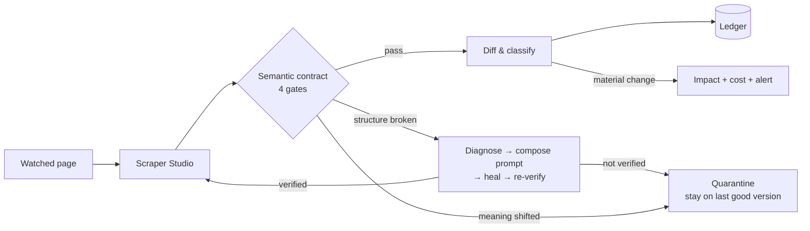

# Executive Summary

[← Documentation index](README.md)

---

## The problem

Software depends on facts that live on other companies' web pages: model prices, rate limits, API parameters, vendor terms. Those pages change without notice. Two failure modes follow, and the second is the dangerous one.

**Loud failure.** A page is redesigned, selectors stop matching, extraction returns nothing. Annoying, but detectable — the pipeline visibly breaks.

**Silent failure.** A provider keeps a headline price at `$2.50` and changes the unit beneath it from *per 1M input tokens* to *input + output combined*. Every selector still matches. Every scraper returns green. Every downstream number is now wrong, and nothing in a conventional monitoring stack can tell.

No structural check catches the second case, because nothing structural broke.

## The system

DriftWatch turns watched pages into **versioned semantic data contracts**, runs them on a schedule through Bright Data Scraper Studio, and gates every extraction behind four checks before any consumer sees it.

Two ideas carry the system:

**1. Contracts that encode meaning, not just shape.** Alongside JSON Schema and range/enum invariants, a contract carries *semantic assertions*: the scraper captures the unit text printed next to each value, and the contract asserts which anchor phrases must appear in it. When the unit silently changes, the schema still passes and the semantics gate fails. That is the only mechanism in the system that can catch the `$2.50` case.
Evidence: `apps/engine/driftwatch_engine/contracts/engine.py :: _gate_semantics`, `fixtures/contracts/nimbusai-pricing.yaml`

**2. A heal loop with the human removed but the proof kept.** Scraper Studio can repair a broken scraper, but its `heal` command stops at an approval gate expecting a person to notice the break, write the prompt, review the preview, and approve. DriftWatch performs all four steps — and critically, **does not trust the heal's own success report**. The preview returned at the gate is re-evaluated against the full contract, and only that verdict decides approval.
Evidence: `apps/engine/driftwatch_engine/healing/orchestrator.py`, `healing/verifier.py`

## Architecture in one paragraph

One Flask process serves the SPA, the JSON API, and the demo mirror site on a single origin; a daemon thread schedules runs; SQLite holds ten tables including an append-only audit ledger. All Bright Data access goes through a `BrightDataClient` Protocol with two implementations (`ReplayClient` for fixtures, `LiveClient` wrapping the official CLI), so switching to live calls is one environment variable above an unchanged seam. All generated prose goes through a `Provider` Protocol whose default implementation is deterministic templates — **the system's decisions never depend on a language model**.
Full detail: [HLD](03_Architecture/HLD.md)

## What is verified

| Claim | Status | Evidence |
|---|---|---|
| Four-gate contract evaluation with weighted confidence | **VALIDATED** | `test_contracts.py` (6 tests) |
| Semantic gate isolates meaning drift from shape drift | **VALIDATED** | `test_contracts.py::test_semantic_drift_fails_only_the_semantics_gate` |
| Entity-resolved diffing survives list reordering | **VALIDATED** | `test_drift.py::test_reordering_entities_is_not_a_change` |
| Five-class classification precedence | **VALIDATED** | `test_drift.py` (6 tests) |
| Heal prompt stays within Bright Data's 1000-char limit | **VALIDATED** | `test_healing.py::test_prompt_is_specific_and_within_limit` |
| Unverifiable heal preview is rejected, never approved | **VALIDATED** | `test_healing.py::test_garbage_preview_is_auto_rejected_never_trusted` |
| Gray-band heals escalate; human approval uses the same API | **VALIDATED** | `test_healing.py::test_gray_band_lands_in_review_and_human_approval_uses_same_api` |
| Full lifecycle across all five drift classes | **VALIDATED** | `test_e2e_pipeline.py::test_full_lifecycle_across_all_drift_classes` |
| Whole pipeline over HTTP, all five classes | **VALIDATED** | Verified in this review — see [Demo Runbook](11_Assessment/Demo_Runbook.md) |

**23 tests pass. `ruff` clean. CI green on `ubuntu-latest`.**

## Measured performance

Replay mode, Intel i9-13900HX / 47.7 GB / Python 3.13.11 / Windows. Excludes network time to Bright Data.

| Operation | p50 | p95 | p99 |
|---|---|---|---|
| Contract evaluation (all four gates) | 0.16 ms | 0.20 ms | 0.31 ms |
| Full pipeline run, no-change path | 6.08 ms | 7.62 ms | 9.87 ms |
| Full pipeline run, structural break + heal + verify + re-run | 12.22 ms | 14.55 ms | 20.99 ms |

Method and caveats: [Performance Validation](07_Testing/Performance_Validation.md)

## What is not built

Stated plainly, because a reviewer will find these anyway:

- **No authentication or authorisation by default.** An opt-in bearer-token gate exists (`DW_API_TOKEN`, added 2026-08-22) covering every route including `POST /api/run-all` and the review-approval endpoint, but it is off unless explicitly configured, and there is still no authorisation/RBAC layer. **PARTIALLY IMPLEMENTED.**
- **No containerisation.** No Dockerfile, no compose file, no orchestration manifests. **NOT IMPLEMENTED.**
- **The live Bright Data path has never completed successfully.** `LiveClient` is written but every recorded attempt failed at the account layer. **UNVALIDATED** — see [AI Architecture](09_AI_ML/AI_Architecture.md#live-path-validation-status).
- **No rate limiting, no CSRF protection, no secrets manager.** **NOT IMPLEMENTED.**
- **No database migrations.** Schema is `CREATE TABLE IF NOT EXISTS` only. **NOT IMPLEMENTED.**
- **No frontend tests.** 581 lines of `app.js` are untested. **NOT IMPLEMENTED.**

## Maturity

| Category | Score (0–5) |
|---|---|
| Architecture | 4 |
| Code quality | 4 |
| Testing (backend) | 4 |
| Testing (frontend) | 0 |
| Reliability | 3 |
| Observability | 3 |
| Performance | 3 |
| Security | 2 (was 1) |
| Deployment | 1 |
| Documentation | 4 |
| AI safety | 3 |
| Data integrity | 3 |

**Classification: Demo Ready.** Not Beta Ready and not Production Ready — the blockers are authentication, deployment packaging, and live-path validation, not architecture. Full justification: [Production Readiness](11_Assessment/Production_Readiness.md).

## Why this is defensible

The engineering thesis is falsifiable and tested: *a healed scraper's output must be re-proven against the same contract that detected the break, or the repair is not trustworthy*. `test_garbage_preview_is_auto_rejected_never_trusted` exists specifically to prove the system refuses a repair it cannot verify. Most self-healing demonstrations show a repair succeeding; this one shows a repair being **refused**.

The honest counterweight: the live integration is unproven, and the demo runs against a controlled mirror. That is disclosed everywhere it matters rather than glossed.
